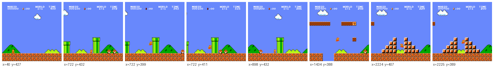
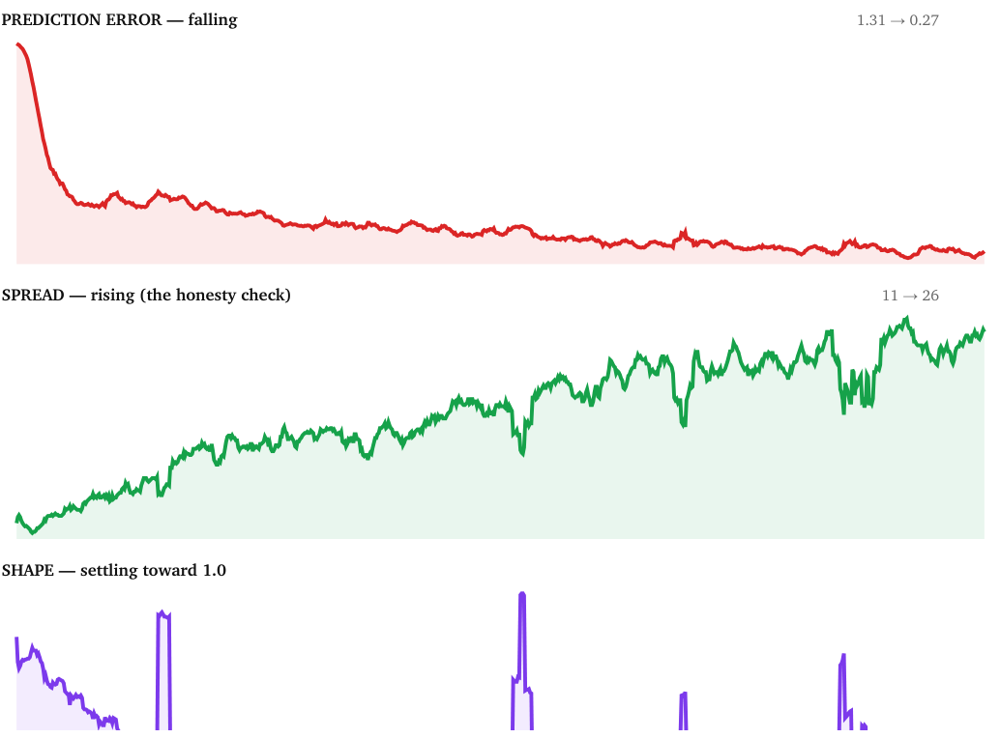
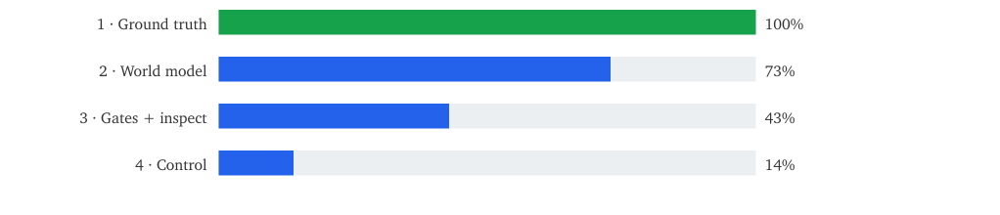
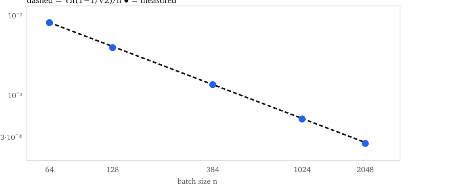
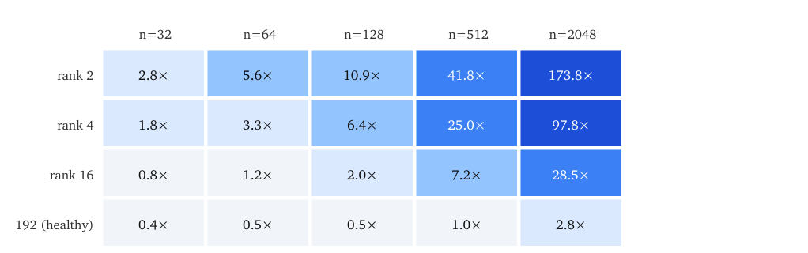
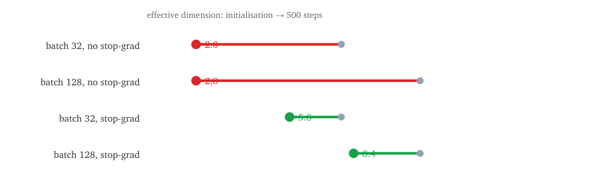
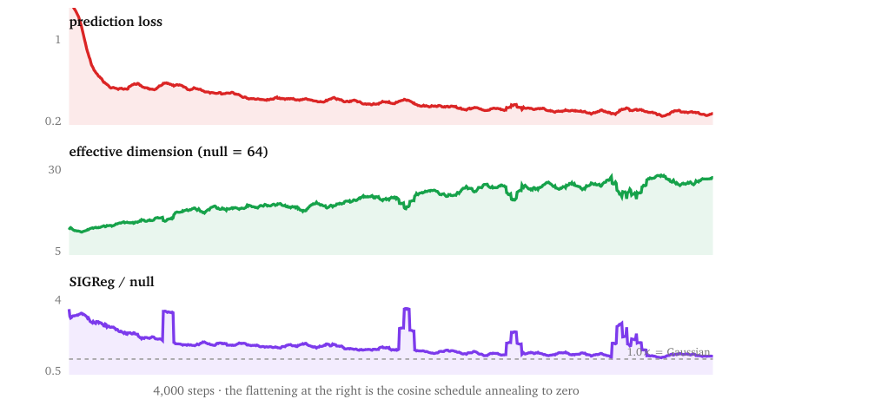
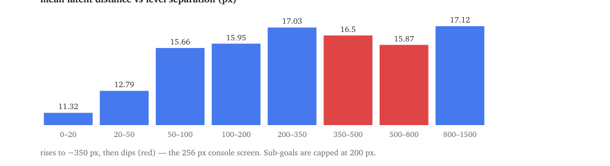
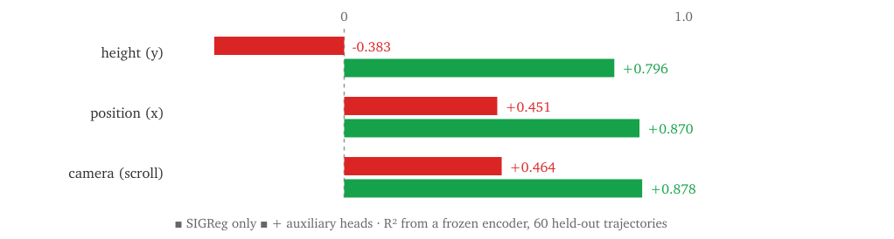

# DOCS

**AQ-Mario** — a world model for Super Mario Bros 1-1: LeJEPA's SIGReg for action-conditioned video, the calibration it needs, the instrumentation that catches a bad run, and everything measured along the way.

*Full project documentation · 8 September 2026 · every number measured, none estimated*

Nav: [`README.md`](README.md)

---

| | |
|:---|---:|
| **Height readable from the model** | **0.943** *(prior: 0.188 · 5.0× better)* |
| **Future it can predict** | **0.719** *(prior: 0.455)* |
| **Training used so far** | **4%** *(half of one pass through the data)* |

---

This document is the full project write-up: experiment narrative, measurement record, SIGReg study, plain-language walkthrough, dataset schema, and stage log.

| Part | Contents |
|:---|:---|
| **[I](#part-i--experiment-report)** | Short experiment narrative |
| **[II](#part-ii--complete-project-record)** | Full measurement record |
| **[III](#part-iii--sigreg-implementation-study)** | Condensed SIGReg calibration study |
| **[IV](#part-iv--explained-from-scratch)** | Long plain-language walkthrough |
| **[V](#part-v--dataset)** | Shard schema, RAM ground truth, regeneration |
| **[VI](#part-vi--stage-log)** | Stage-by-stage deliverables and exit criteria |

---

# Part I — Experiment report

## Teaching a machine to imagine Mario

AQ-Mario — a world model for Super Mario Bros 1-1, and the instruments that tell you when it is lying.

> The goal is a model that has learned what *happens* in Mario — not one that can draw Mario. The test is whether Mario's height off the ground can be read back out of the model's internal state. A previous attempt at this scored **0.188** out of 1. This one scores **0.943**.

### 1. What is actually being built

A **world model** is a machine that has learned the rules of a world well enough to run it forward in its head. Show it three frames of Mario and tell it which buttons get pressed next, and it should be able to say what happens — without touching the game.

The unusual part is *where* it predicts. It does not draw the next picture. It compresses each frame into **192 numbers** and predicts those. Drawing pixels wastes most of the model's effort on clouds and brick textures; the 192 numbers are supposed to hold only what matters — where Mario is, how fast, what is about to kill him.



*Figure I.1. One real training episode. Each frame is stored with the true values pulled straight out of the console's memory: `x` is distance along the level, `y` is height on screen. Those true values are never shown to the model — they are the answer key used to grade it afterwards.*

> **The one idea to take away.** You cannot grade a world model by asking how confident it is. You grade it by opening it up and checking whether the facts you know are *findable inside it*. That is what "0.943" means: given only the model's 192 numbers, Mario's height can be recovered with 94.3% accuracy. The model was never told about height. It worked it out.

### 2. Why the previous attempt failed

The earlier effort, LeMario, built a similar model and then tried to plan with it — to search for a button sequence that would get Mario further. Planning failed, repeatedly. Only afterwards, by hand, did anyone check whether the model knew how high Mario was. It scored 0.188, which is close to knowing nothing.

The model had learned to track Mario horizontally almost perfectly and had thrown vertical position away. In a game that is mostly jumping, that is fatal — and it was invisible until months of planning work had been spent.

> **The change in method.** This project inverts the order. The check that took LeMario months of failed planning to reach runs automatically, on every saved model, from epoch two. If height is not recoverable, the run is stopped. Nothing downstream gets built on a broken foundation. That is the entire thesis, and everything below is in service of it.

### 3. How the data was made

Two robots played Mario 8,000 times on a rented fleet of 16 machines.

| Player | Episodes | What it contributes | Reaches |
|:---|---:|:---|---:|
| Random — biased toward running right and jumping | 4,000 | Falls in every hole, hits every enemy. Teaches the model how death looks. | ~45% |
| Trained — a reinforcement-learning agent | 4,000 | Actually gets somewhere. Covers the back half of the level. | 100% |

The second player was necessary and not obvious: the random one never gets past the first pipe complex, so a model trained only on its games would be graded on the opening 45% of the level and the score would not be comparable to anyone else's. The trained agent was deliberately stopped early, the moment it could reliably reach three-quarters of the way — an agent that finishes perfectly every time supplies 4,000 copies of one identical run, which teaches the model almost nothing.

Result: 2.7 million frames from the random player alone, 14.7 GB. Raw, that is 992 GB of pictures; the compression works because NES artwork is extremely repetitive.

### 4. The instruments

Four numbers are watched during training. Two of them are easy to misread, and misreading them is what nearly sank this experiment.

| Instrument | Plain English | Good |
|:---|:---|:---|
| Prediction error | How wrong the model's guess about the future is. | lower |
| Explained future | Share of what happens next that the model correctly anticipates. 0 = guessing the average, 1 = perfect. | higher |
| Spread | How many of the 192 numbers are actually carrying information. | higher |
| Shape | Whether the 192 numbers are distributed healthily rather than piling up in a corner. | near 1.0 |

> **The trap.** A model that gives up entirely scores a perfect prediction error. If it maps every possible frame of Mario to the same 192 numbers, then predicting the future is trivial — the future is always the same thing. Prediction error collapses toward zero and "explained future" climbs toward 1.
>
> This is not hypothetical. It happened here on the first real run: the model scored **0.939** on explained future — which would have beaten the previous attempt's 0.455 outright — while spread sat at **1.17** out of a healthy 27. Every frame of Mario had been crushed onto a single line. The model knew nothing and the headline number looked excellent. Spread is the honesty check; without it every other number can be faked.

### 5. What went wrong, and the fix

Finding the collapse took seven steps. Each one is a thing that was quietly wrong.

1. **The safety check had a hole.** It asked only "is the error falling?" A collapsing model passes that perfectly. It now also demands that spread does not shrink.
2. **Two instruments were reading the wrong sample size** and reported a healthy model as 6× worse than it was — a fake alarm sitting next to a real one.
3. **The anti-collapse safeguard was too weak to see the problem.** Its sensitivity depends almost entirely on how many examples it sees at once. At the batch size in use it could barely distinguish a fully collapsed model from a healthy one.
4. **Turning that safeguard up did not help**, and the arithmetic says why: collapsing earns the model 0.80 of prediction error, while every safeguard combined cost it 0.02. It was outgunned 45 to 1.
5. **The real cause was structural.** The model was being graded against a target it was also allowed to move. Making the target constant is the easiest way to hit it. Freezing the target removed the incentive entirely.



*Figure I.2. The healthy pattern, from the actual run. Error falls while spread rises. The failure looked identical on the top chart and went to 1 on the middle one. The flattening at the right is deliberate — the learning rate is wound down to zero to end the run cleanly, not the model running out of ideas.*

### 6. Results

The model is then frozen and interrogated: given only its 192 numbers, can a simple reader recover facts about the game? R² of 1.0 means perfect recovery, 0.0 means none.

| Question put to the model | This model | LeMario | Target | |
|:---|---:|---:|---:|:---|
| How high is Mario? | **0.943** | 0.188 | 0.90 | PASS |
| How far along the level is he? | 0.963 | 0.997 | 0.97 | marginal |
| Where is the camera? | 0.962 | — | 0.90 | PASS |
| Is he about to die? | 0.967 | — | — | 31× baseline |

> **The headline.** The single question LeMario got wrong — how high is Mario — went from 0.188 to 0.943. And this is from a model trained on roughly 4% of the planned schedule: half of one pass through half of the data. It was not a hard problem once it was being measured.

#### The one thing that does not pass

A fourth check asks whether the model can tell apart two moments that are far apart in the level. It fails. The diagnosis is specific and useful: the model's sense of distance grows reliably out to about **350 pixels** of separation and then goes flat — two places roughly two screen-widths apart start to look alike. The console screen is 256 pixels wide, so this is the camera.

This matters for what comes next. The planner is designed to steer toward goals about **200 pixels** ahead at a time — a number picked on intuition before any of this was measured. The measurement says the model is trustworthy out to 350. The guess and the measurement agree, which is the useful outcome: the plan is safe, and now it is safe for a stated reason.

### 7. Where this is

| Stage | What it delivers | Done |
|:---|:---|---:|
| 1 · Ground truth | 8,000 games with trustworthy answer keys | ~90% |
| 2 · World model | The model itself, trained without collapsing | ~75% |
| 3 · Instruments | Automatic checks that stop a bad run early | ~55% |
| 4 · Control | Use the model to actually play; steer it by hand | ~15% |

Everything is written and tested — 141 automated checks, all passing. What remains is mostly compute: the full training run, and then using the model to play.

**What would make it better**

- **Finish training.** These results are from 4% of the planned run. Every trend was still improving when it stopped.
- **Use the second dataset.** The trained player's 4,000 games — covering the back half of the level — are being collected now and were not in this model at all.
- **Faster hardware.** ~3 hours instead of ~12 for the full run.
- **A sampling fix already made.** Deaths are rare — 1 in 130 frames — so half of all training batches contained no death at all and the model got no signal about dying on those steps. Now corrected; it was also the cause of the jagged training curve.

> **Honest summary.** The thing this project set out to prove — that you can catch a world model's blind spot by inspecting it rather than by watching it fail downstream — worked. The blind spot that cost LeMario months was caught automatically, and then fixed, in a run that used 4% of its training budget. The instruments themselves needed four separate corrections along the way, and each of those corrections is written down, because an instrument you have not calibrated is not evidence.

---

# Part II — Complete project record

Implementing LeJEPA's SIGReg for action-conditioned video — the calibration it needs, the instrumentation that catches a bad run, and everything measured along the way.

**What this is.** A 9.8M-parameter JEPA world model trained on 8,000 episodes of Super Mario Bros 1-1, built as a study of two questions: does SIGReg transfer out of image self-supervised learning into a world model for control, and can a representation's fitness be gated automatically, per checkpoint, instead of discovered after a planner fails.

**What was found.** The objective transfers but needs four corrections that are not visible from the image-domain framing: a closed-form null without which λ is not comparable across batch sizes; a collapse-detection power that scales with batch size and therefore conflicts with the memory cost of video; a 25× signal reduction from the BatchNorm the architecture requires; and a broken iid assumption on temporally correlated batches. In this setting the stop-gradient was still required. And at the application level, preventing collapse did not preserve usable state: an uncollapsed representation scored R² = −0.383 on the single variable a planner needs.

**Status.** All four stages are implemented and tested (161 automated checks). Results below come from a 4,000-step run — roughly 4% of the planned schedule. The full-budget run and Stages 3–4 are built but not yet executed.

### Contents

1. [The problem and the design](#1--the-problem-and-the-design)
2. [Stage 1 — data and ground truth](#2--stage-1--data-and-ground-truth)
3. [The model](#3--the-model)
4. [The calibration SIGReg needs](#4--the-calibration-sigreg-needs-and-does-not-ship-with)
5. [Batch size is a SIGReg hyperparameter](#5--batch-size-is-a-sigreg-hyperparameter)
6. [BatchNorm halves the job](#6--batchnorm-halves-the-job)
7. [Correlated batches break the null](#7--correlated-batches-break-the-null)
8. [The stop-gradient was still required](#8--the-stop-gradient-was-still-required)
9. [The collapse, and how it was found](#9--the-collapse-and-how-it-was-found)
10. [Results](#10--results)
11. [Anti-collapse ≠ usable state](#11--anti-collapse--usable-state)
12. [Instrumentation that pays for itself](#12--instrumentation-that-pays-for-itself)
13. [Six bugs, and how each surfaced](#13--six-bugs-and-how-each-surfaced)
14. [Built but not yet run](#14--built-but-not-yet-run)
15. [Limitations](#15--limitations)
16. [Practice, and where everything lives](#16--practice-and-where-everything-lives)

For the condensed SIGReg-focused write-up of the same measurements, see [Part III](#part-iii--sigreg-implementation-study). For the long plain-language walkthrough, see [Part IV](#part-iv--explained-from-scratch).

---

## 1 · The problem and the design

A world model learns an environment's dynamics well enough to roll them forward internally: given a few frames and a sequence of actions, predict what follows. This one predicts in a 192-dimensional latent space rather than in pixels — predicting pixels spends most of the model's capacity on clouds and brick texture, while the latent is meant to hold only what matters for control.

That creates the central difficulty. A latent-space prediction objective has a trivial solution: map every possible frame to the same latent, and prediction becomes free. Preventing that collapse is what SIGReg is for, and testing whether it succeeds outside image SSL is what this project is.

The second design commitment: the run is graded on its representation, not its loss. Every collapsed model in this project reported an excellent loss. The evaluation is instead a set of frozen-encoder probes — can the height of the character, its position, the camera, and imminent death be read back out of the 192 numbers — run automatically on every checkpoint, with a fail-closed abort.



*Figure 1. Stage completion as reported by `algo.tracker`, which probes real state — files, shard counts, metrics, gate JSON — rather than checkboxes.*

## 2 · Stage 1 — data and ground truth

8,000 episodes across a fleet of 16 machines: **4.88M observations, 27.4 GB compressed** (992 GB of raw pixels; NES artwork deflates 27×).

| Policy | Episodes | Observations | Why it exists | Reaches |
|:---|---:|---:|:---|---:|
| jump-biased random | 4,000 | 2,674,774 | falls in every pit, hits every enemy — teaches what death looks like | ~45% |
| PPO explorer | 4,000 | 2,202,594 | covers the back half; a representation graded only on a level's opening is graded on the easy half | 100% |

The PPO agent was stopped early on purpose, the moment its rolling mean reached 2,400 of the flagpole's 3,161 — an agent that finishes perfectly supplies 4,000 copies of one trajectory, which is worse for coverage than one that dies in interesting places. It peaked at 3,161 (the flagpole) with a mean of 2,424.


*Figure 2. One training episode. `x` and `y` are read from console RAM and are never model inputs — they are the probe targets used to evaluate the frozen representation afterwards.*

> **Ground truth you can trust.** RAM addresses ship as *candidates*, not constants, because a wrong address does not crash — it silently corrupts every probe, gate and planner cost. `scripts/helpers/validate_ram.py` picks the winner empirically and `collect_data.py` refuses to run until it has. The chosen player-y pair reproduces the environment's own reported value with R² = 1.0000000000 over 300 frames, and the production container was verified independently: our RAM read returned `world_x = 87` against the emulator's `info_x = 87`.

## 3 · The model

| Component | Params | Note |
|:---|---:|:---|
| encoder — ViT-Tiny patch-14 @ 224px | 5.65M | 257 tokens/frame → CLS → MLP → `BatchNorm(affine=False)` |
| predictor — 6 × AdaLN-Zero, causal | 4.04M | 3 context frames → next 5 latents |
| action encoder | 0.04M | 2 frames × 6 buttons → 192 |
| auxiliary heads | 0.07M | height, camera, death-within-5; ablated in the control |
| **total** | **9.80M** | |

Four choices that are load-bearing, each of which has a plausible alternative that quietly breaks the run:

- **BatchNorm, not LayerNorm, at the end of the projection.** A trailing LayerNorm puts every embedding on a fixed-radius sphere, which fights the isotropic-Gaussian target directly.
- **Actions enter by AdaLN-Zero, not concatenation.** Concatenated action tokens let the predictor ignore the action for thousands of steps and learn "the next frame resembles this one" — the degenerate solution that leaves height unencoded. AdaLN-Zero starts as an exact identity, so the action is the only thing that can modulate it.
- **Frame skip 2, not 5.** A jump arc is ~30 emulator frames; at skip-5 it is six samples, and vertical information barely helps one-step prediction, so the objective discards it.
- **Future slots are mask tokens under a causal mask.** Slot *t+1* attends only to slot *t*, itself a prediction — so multi-step rollout is the training objective rather than something bolted on at evaluation.

The parameter count is 9.8M against the ~15M the original plan assumed. That is reported as under-band rather than the band being widened to fit; closing the gap means raising `predictor_layers`, which is a deliberate experiment, not a rounding.

## 4 · The calibration SIGReg needs and does not ship with

SIGReg compares the empirical characteristic function of each 1-D random projection to the Gaussian one. Under the null, $E|\varphi_n - \varphi|^2 = (1 - e^{-t^2})/n$ exactly, so integrating against the Gauss–Hermite weight gives a closed form for the value a *perfectly* Gaussian embedding produces:

$$
E[T \mid z \sim N(0, I)] = \sqrt{\pi} \cdot (1 - 1/\sqrt{2}) / n = 0.51914 / n
$$



*Figure 3. Predicted vs measured null, $n = 64 \ldots 2048$; agreement within 3% throughout.*

At batch 64 the term floors at **0.0013** however Gaussian the encoder becomes. Driving SIGReg toward zero is not the goal; reaching ≈1.0× null is.

Raw values from runs at different batch sizes are not comparable, so neither are their λ. The comparable quantity is $\mathrm{ratio} = T / \mathrm{null}(n)$.

Since the floor is sampling noise, the optimiser can push slightly below 1.0× by making the batch mildly repulsive. Benign, and a second reason the target is a ratio near one.

### What the statistic can and cannot see

| Latent pathology *(n=384, D=192, null = 0.00123)* | × null |
|:---|---:|
| all latents identical | 410× |
| wrong global scale ($z \times 3$) | 321× |
| rank-8 collapse | 254× |
| heavy radial tail | 30× |
| anisotropic covariance | 10× |
| **blind spots — the projection CLT hides these:** | |
| 5% of points at 8σ | 2× |
| per-coordinate bimodality | 1.1× |
| unit shell at radius $\sqrt{D}$ | 1.1× |

A random 1-D projection of a 192-dim distribution is nearly Gaussian unless the covariance or the radial law is wrong. SIGReg is therefore a guarantee against collapse — always a rank or scale failure — not a certificate that the embedding is Gaussian in every respect.

## 5 · Batch size is a SIGReg hyperparameter

SIGReg / its own null. A detector needs the collapsed rows far above the healthy row.

| | n=32 | n=64 | n=128 | n=512 | n=2048 |
|:---|---:|---:|---:|---:|---:|
| rank 2 | 2.8× | 5.6× | 10.9× | 41.8× | 173.8× |
| rank 4 | 1.8× | 3.3× | 6.4× | 25.0× | 97.8× |
| rank 16 | 0.8× | 1.2× | 2.0× | 7.2× | 28.5× |
| 192 (healthy) | 0.4× | 0.5× | 0.5× | 1.0× | 2.8× |



*Figure 4. SIGReg in units of its own null for a rank-$r$ latent after BatchNorm.*

At $n = 32$ a fully collapsed latent reads 2.8× against a healthy 0.4× — barely separable, so the term cannot resist what it can hardly see. At $n = 512$ the same collapse reads 41.8× against 1.0×.

> **The tension specific to video.** A world-model step encodes $\mathrm{batch} \times \mathrm{window}$ images — at window 8 and batch 96 that is 768 images and 197,376 ViT tokens, LLM-scale token throughput from a 9.8M-parameter model. Memory therefore pushes the batch *down*, into exactly the regime where SIGReg is weakest. Activation checkpointing is not a throughput optimisation here; it is what buys the regulariser its statistical power.

## 6 · BatchNorm halves the job

The projection head must end in BatchNorm (§3). But BatchNorm pins the covariance diagonal for free, which is a large part of what SIGReg was detecting: a rank-8 latent reads **254× null raw and 10× after BN**. Still unambiguous, **25× less signal**. The two are complementary rather than reinforcing, and SIGReg values from a BN-projected encoder are a different quantity from those without one.

The corresponding positive result, and the single experiment that says the design is sound: SIGReg escapes a rank-8 collapse only when the gradient flows through the BatchNorm, as it does in a real encoder. Optimising the latent as a free tensor barely moves it.

| Step | SIGReg | × null | Effective dim |
|---:|---:|---:|---:|
| 0 | 0.0139 | 10.0 | 7.9 |
| 100 | 0.0051 | 3.8 | 21.5 |
| 300 | 0.0021 | 1.6 | 52.0 |
| 600 | 0.0015 | 1.1 | 69.5 |

## 7 · Correlated batches break the null

A world-model batch is $B$ windows × $W$ near-identical frames — two emulator frames apart at skip-2 — so it holds $B$ independent samples, not $B \times W$. Measured on a synthetic full-rank latent batched as $32 \times 6$:

| How it is scored | Reads | Verdict |
|:---|---:|:---|
| flattened, against the $n{=}192$ null | 6.7× | "collapsing" |
| flattened, against the honest $n{=}32$ null | 1.2× | fine |
| per frame position, averaged | 1.1× | fine |

Flattening also makes SIGReg penalise the within-window similarity the predictor depends on — it pushes consecutive frames apart while the prediction loss pulls them together. Scoring per frame position keeps every latent, makes the null exact at $n = B$, and removes the conflict.

The same correction applies to the effective-dimension diagnostic. Marchenko–Pastur gives $E[\mathrm{PR}] = nD/(n+D)$, so a genuinely full-rank 192-dim latent reads 128, not 192, at $n = 384$ — measured 127.6 against the formula's 128.0, and 175.5 against 175.5 at $n = 2048$. Inverting it recovers $192.0 \pm 1$ at every $n$ and stays at 7.6 on a rank-8 latent.

## 8 · The stop-gradient was still required



*Figure 5. Effective dimension, initialisation → 500 steps. Without the stop-gradient both batch sizes collapse to rank 2 while reporting a 5-step gain of 0.97.*

| Condition | Effective dim (init → 500) |
|:---|---:|
| batch 32, no stop-grad | 2.0 |
| batch 128, no stop-grad | 2.0 |
| batch 32, stop-grad | 5.8 |
| batch 128, stop-grad | 8.4 |

λ alone could not substitute: swept without the stop-gradient it gave effective dimensions of 1.08, 1.89 and 3.50 at λ = 0.1, 1 and 5 — all collapsed. The arithmetic says why:

| λ | Prediction loss saved by collapsing | SIGReg cost | Aux cost | Outgunned by |
|---:|---:|---:|---:|---:|
| 0.1 | 0.796 | 0.010 | 0.008 | 45× |
| 1.0 | 0.778 | 0.065 | 0.008 | 11× |
| 5.0 | 0.745 | 0.181 | 0.008 | 4× |

> **Why a world model is a harder case than image SSL.** With a shared encoder, $\mathrm{MSE}(\hat{z}, z_{\mathrm{target}})$ is directly minimised by making the target constant, because the target is produced by the same trainable network. Collapse is not a failure mode to be avoided — it is the objective's global optimum unless something removes the incentive. And the prediction task here is unusually easy to trivialise: a rank-1 latent still has unit variance per coordinate after BatchNorm, so the predictor need only predict one scalar.

With the stop-gradient in place λ becomes an effective lever. At λ=10 the effective dimension doubles over training rather than falling:

| λ | Aux scale | Effective dim (init → 1500) | Gain₅ | SIGReg |
|---:|---:|:---|---:|---:|
| 10 | 20 | 10.3 → 21.1 | 0.654 | 1.4× |
| 10 | 1 | 10.3 → 20.4 | 0.545 | 1.5× |
| 1 | 20 | 10.3 → 9.7 | 0.778 | 3.0× |
| 1 | 1 | 10.3 → 8.9 | 0.817 | 3.3× |

Note the trade-off: λ=1 predicts better on a narrower latent. Which is right is decided by the probe, not by either column — the entire argument for gating on the representation.

## 9 · The collapse, and how it was found

The first full dry run passed its gate while collapsing, and unpicking that produced most of what is now known about this model.

> **The trap, in one line.** `pred_loss 0.975 → 0.061`, `gain₅ = 0.939` — an excellent-looking result — with effective dimension at **1.17** out of a healthy 27. Every frame of the game had been crushed onto a single direction. The prediction task was trivially solved because there was nothing left to predict, and the gate at the time only asked "did the losses move?", which a collapsing run satisfies perfectly.

A rank-1 latent still has unit variance per coordinate after BatchNorm, so `gain` — the metric intended to be comparable across models — reads near 1.0 on a model that knows nothing. **Effective dimension is the only metric here a collapsed-but-confident run cannot fake**, and it is now the one wired to the abort.



*Figure 6. The healthy pattern, from the run all results below come from. Prediction loss falls while effective dimension rises. The failure looked identical on the top panel and went to 1 on the middle one. 4,000 steps · the flattening at the right is the cosine schedule annealing to zero.*

## 10 · Results

All from a 4,000-step run — ≈0.55 of one epoch, ~4% of the planned schedule — with λ=10, `aux_scale`=20, stop-gradient on, batch 96. Encoder frozen; probes fit and scored on disjoint sets of complete trajectories.

| Probe | In-distribution | Full level | Threshold |
|:---|---:|---:|---:|
| height (y) | **0.943** | 0.796 | 0.80 |
| position (x) | 0.963 | 0.870 | 0.95 |
| camera (scroll) | 0.962 | 0.878 | 0.90 |
| death within 5 steps (AUC) | 0.967 | 0.927 | — |

Average precision on death is 0.256 against a base rate of 0.0096 — **27×** — which is the number to read at a 1% positive rate; accuracy is meaningless there and is deliberately not reported.

The gap between the two columns is the result, not an inconvenience. This model trained on random-play data only — the opening ~45% of the level. "In-distribution" scores it on that same behaviour; "full level" scores it across all 8,000 episodes including the back half it has never seen. Reporting only the first number would be reporting the easy half.

### Independent replication and controls

Re-fit and re-scored on shards collected in a separate run, never seen by training:

| Predictor of height | R² |
|:---|---:|
| trained encoder (192 dims) | **0.932** |
| trained encoder, linear probe only | 0.868 |
| raw pixels, 112×112 (12,544 dims) | 0.028 |
| raw pixels, 56×56 | 0.014 |
| random projection of pixels → 192 | −0.180 |
| horizontal position alone → height | −0.024 |
| predict the training mean | −0.016 |
| untrained encoder | 0.013 |
| trained encoder, shuffled labels (code sanity check) | −0.439 |

No pixel baseline clears 0.03 at any resolution, so the task is not trivially solvable. The linear probe at 0.868 shows the information is nearly linearly present rather than manufactured by the probe's MLP. Per-episode R² is tight (min 0.896, median 0.931). Held-out frames sit 1.29× further from training frames than training frames sit from each other, so this is not duplicate leakage.

### The camera



*Figure 7. Latent distance against level separation. It rises cleanly to ~350 px and then dips — the console screen is 256 px wide, so two frames about two screens apart start to look alike. Sub-goals are capped at 200 px.*

| Separation (px) | Mean latent distance |
|:---|---:|
| 0–20 | 11.32 |
| 20–50 | 12.79 |
| 50–100 | 15.66 |
| 100–200 | 15.95 |
| 200–350 | 17.03 |
| 350–500 | 16.5 |
| 500–800 | 15.87 |
| 800–1500 | 17.12 |

A strict margin test on this fails, and unrolling it is more useful than the number. "Near" means near in $x$ only — a character standing, mid-jump and dying all sit at one $x$ — so near-pair distance has a floor that has nothing to do with the camera. Decisively, position is recoverable at R² = 0.870, and a latent you can read position out of is not aliased in the sense the margin claims. The criterion that matters for planning is the range over which distance stays monotone: **350 px measured**, against a planner sub-goal span of **200 px** chosen on intuition before any of this existed. The guess and the measurement agree, and the design is now safe for a stated reason.

## 11 · Anti-collapse ≠ usable state

The control: identical recipe, identical data, identical step count, auxiliary terms removed from the loss entirely. It did not collapse, and still could not report the height of the character.



*Figure 8. Frozen-encoder probe R², 60 held-out trajectories, full dataset. ■ SIGReg only ■ + auxiliary heads.*

| Probe | SIGReg only | + aux heads (0.07M params) |
|:---|---:|---:|
| height (y) | **−0.383** | **0.796** |
| position (x) | 0.451 | 0.870 |
| camera (scroll) | 0.464 | 0.878 |
| death within 5 (AUC) | 0.628 | 0.927 |
| latent distance usable to | 0 px | 350 px |

An isotropic-Gaussian embedding is a floor, not a sufficient condition: it guarantees the representation is non-degenerate, not that it contains what the downstream task requires. A head worth 0.7% of the model's parameters recovers it.

> **What this comparison does and does not show.** The auxiliary variant is trained to make height decodable and then measured for whether height is decodable. It is not a fair test of representation quality, and it is not evidence that the self-supervised objective learned anything better. What it shows is narrower and still useful: a cheap supervised head fixes the problem, and the probe gate detects its absence at 4% of the training budget with no planner built.

## 12 · Instrumentation that pays for itself

Every checkpoint — one per 10% of training — saves weights, re-estimates BatchNorm statistics, fits the probes on held-out trajectories, and compares against the previous checkpoint on four axes:

| Check | Question | The failure it maps to |
|:---|:---|:---|
| learning | is prediction loss below last checkpoint | the run is stuck |
| not collapsing | is effective dim ≥ 85% of best seen | the rank-1 shortcut |
| regularised | is SIGReg within 5× its own null | latent drifting non-Gaussian |
| representing | is the height probe rising | the one a collapsed run cannot fake |

Below a floor, and not improving across two consecutive checkpoints, the run raises `GateAbort` and stops — a dead run costs 35 minutes instead of the full budget. The requirement for a trend rather than a single reading is itself measured: a healthy run scored 0.12 at 10%, and aborting on one low number would have killed it.

## 13 · Six bugs, and how each surfaced

Recorded because the pattern is the point: none of these were visible from reading the code.

| Bug | How it surfaced | What it would have cost |
|:---|:---|:---|
| Gate accepted a collapsing run | reading effective dim next to the loss | a "0.939 gain" headline on a rank-1 model |
| Diagnostics scored against the wrong sample count | computing the null by hand | healthy runs reported as 6.7× collapsed |
| Identical data order every epoch | iterating the loader twice and diffing | epochs 2–3 replay epoch 1; shuffling did nothing |
| SIGReg ran in bf16 under autocast | emulating autocast against fp32 | 1.0% error — the size of the entire null |
| LR schedule built on a 14.5%-low estimate | counting real windows vs the formula | last ~15% of every run at ~zero learning rate |
| Stale BatchNorm statistics at evaluation | taking a mid-training checkpoint and re-measuring | y-probe −0.028 on an encoder measuring +0.121 |

The last one is the most instructive. Every downstream measurement runs the encoder in `eval()`, where BatchNorm uses running statistics that lag while the encoder is still learning. End-of-run measurements are unaffected because the learning rate has annealed — which is exactly why it survives undetected until someone takes a mid-training checkpoint.

## 14 · Built but not yet run

| Stage | State |
|:---|:---|
| Full-budget training | Configured and launched twice, stopped both times for the audit above. 38,104 steps, ~1.8 h/run. |
| Sparse autoencoder + λ feature diff | Written and verified end-to-end at `d_model=192` on synthetic latents. Reports which features each λ destroys and cross-references them against RAM ground truth, so the answer is "the features that vanish are the ones tracking height" rather than "37 features changed". |
| Planner (categorical CEM over 5 macro-actions, probe-scored cost) | Written, 11 unit tests, never run against a trained model. Categorical rather than Gaussian-over-buttons on purpose; sub-goals capped at 200 px, inside the certified range from §10. |
| SAE-feature steering | Written and tested (reversible forward hook on the predictor's residual stream). Not demonstrated. |

## 15 · Limitations

- **Training budget.** Every number here comes from 4,000 steps, ~4% of the planned schedule, on half the dataset. The SIGReg-only result in §11 is therefore also a statement about a young encoder: the honest reading of −0.383 is "did not acquire height at this budget", not "cannot".
- **The aux comparison is not a representation-quality result** (§11 box).
- **One environment, one level, one visual style.** §4–§7 are properties of the statistic and should transfer; §8–§11 are empirical and may not.
- **The paper's claims are paraphrased here, not quoted.** The measurements are ours; the characterisation of LeJEPA's position in §8 should be checked against the paper text before publication.
- **Probe capacity is a confound in absolute R².** The MLP probes are held fixed across all comparisons, so the comparisons stand, but the absolute numbers depend on that choice.

## 16 · Practice, and where everything lives

1. Report $\mathrm{SIGReg} / \mathrm{null}(n)$, never raw SIGReg; publish the batch size next to λ.
2. In video or RL, compute the statistic per frame position, not over the flattened batch.
3. Treat batch size as a SIGReg hyperparameter. Its collapse-detection power is roughly linear in $n$.
4. Do not assume the stop-gradient is removable outside image SSL at practical batch sizes.
5. Re-estimate BatchNorm statistics before any mid-training evaluation.
6. Anti-collapse is not representation quality. Gate on a probe of the state the downstream task actually needs — it costs minutes, and it is the only measurement here that a collapsed-but-confident model cannot fake.

| Artefact | Location |
|:---|:---|
| code, 161 automated checks | this repository |
| 8,000 episodes, 27.4 GB | Modal volume `aqmario-data` |
| checkpoints, gates, PPO explorer | Modal volume `aqmario-runs` |
| live stage board | `python -m algo.tracker` |
| the settings, with why each was chosen | `recipe.yaml` — pinned to the code by test |

---

# Part III — SIGReg implementation study

## SIGReg outside image SSL: calibrating LeJEPA for a world model

An implementation study of LeJEPA applied to action-conditioned video, with the corrections the objective needs in that setting.

*AQ-Mario · Super Mario Bros 1-1 · 8 September 2026 · every number measured, none estimated*

> **Summary.** We implement LeJEPA's SIGReg objective in a domain it was not developed for — an action-conditioned world model over video, evaluated by whether a control-relevant state variable survives in the representation. The objective transfers, but not unmodified. We report (i) a closed-form null for the SIGReg statistic, without which its value and therefore λ are not comparable across batch sizes; (ii) its collapse-detection power is approximately linear in batch size, placing it in direct tension with the memory cost of video; (iii) a trailing BatchNorm, which the architecture requires, reduces its collapse signal 25×; (iv) temporally correlated batches break its iid assumption, making a healthy latent read as collapsed; (v) in this setting the stop-gradient was still required, contrary to the simplification claim; and (vi) at the application level, preventing collapse did not preserve usable state — an uncollapsed representation scored R² = −0.383 on the one variable a planner needs.

### 1. Setup

A 9.8M-parameter JEPA over Super Mario Bros 1-1. ViT-Tiny patch-14 at 224px encodes each frame to a 192-dim latent through an MLP head ending in `BatchNorm(affine=False)`; a 6-block causal predictor conditioned on actions through AdaLN-Zero predicts the next 5 latents from 3 of context. Trained bf16 on a single H100.

| Component | Params | Note |
|:---|---:|:---|
| encoder (ViT-Tiny p14 @224) | 5.65M | 257 tokens/frame |
| predictor (6 × AdaLN-Zero) | 4.04M | causal over the window |
| action encoder | 0.04M | 2 frames × 6 buttons → 192 |
| auxiliary heads | 0.07M | ablated in the control |

**Data.** 8,000 episodes, 4.88M observations, 27.4 GB compressed. Two behaviour policies: a jump-biased random policy (reaches ~45% of the level) and a PPO explorer trained to the flagpole, because a representation graded only on the opening of a level is graded on the easy half. Ground truth for x, y, scroll and death comes from console RAM, validated against the emulator's own reported values.


*Figure III.1. One training episode. `x` is distance along the level and `y` is height on screen, both read from RAM. These are never inputs — they are the probe targets used to evaluate the frozen representation afterwards.*

> **Evaluation protocol.** Encoder frozen, MLP probes fit on held-out complete trajectories and scored on a disjoint set of 60. Splitting by observation rather than trajectory leaks badly here: consecutive frames are near duplicates. Reported R² is against held-out variance and is allowed to go negative.

### 2. The calibration SIGReg needs and does not ship with

The Epps–Pulley statistic compares the empirical characteristic function of each 1-D projection to the Gaussian one. Under the null, $E|\varphi_n - \varphi|^2 = (1 - e^{-t^2})/n$ exactly, so integrating against the Gauss–Hermite weight gives a closed form for the value a *perfectly* Gaussian embedding produces:

$$
E[T \mid z \sim N(0, I)] = \sqrt{\pi} \cdot (1 - 1/\sqrt{2}) / n = 0.51914 / n
$$


*Figure III.2. Predicted vs measured null, $n = 64 \ldots 2048$. Agreement within 3% throughout.*

Three consequences that matter in practice:

- At batch 64 the term floors at **0.0013** no matter how Gaussian the encoder becomes. Driving SIGReg toward zero is not a goal; reaching ≈1.0× null is.
- Raw SIGReg values from runs at different batch sizes are not comparable, so neither are their λ. The comparable quantity is $\mathrm{ratio} = T / \mathrm{null}(n)$.
- Because the floor is sampling noise, the optimiser can push slightly below 1.0× by making the batch mildly repulsive. That is benign, and a second reason the target is a ratio near one rather than a loss near zero.

### 3. Its power to see a collapse scales with batch size

| | n=32 | n=64 | n=128 | n=512 | n=2048 |
|:---|---:|---:|---:|---:|---:|
| rank 2 | 2.8× | 5.6× | 10.9× | 41.8× | 173.8× |
| rank 4 | 1.8× | 3.3× | 6.4× | 25.0× | 97.8× |
| rank 16 | 0.8× | 1.2× | 2.0× | 7.2× | 28.5× |
| 192 (healthy) | 0.4× | 0.5× | 0.5× | 1.0× | 2.8× |

SIGReg / its own null. A detector needs the collapsed rows far above the healthy row.


*Figure III.3. SIGReg in units of its own null, for a rank-$r$ latent after BatchNorm, $D = 192$.*

At $n = 32$ a fully collapsed latent reads 2.8× against a healthy 0.4× — barely separable, so the term cannot resist what it can hardly see. At $n = 512$ the same collapse reads 41.8× against 1.0×.

> **The tension specific to video.** A world-model step encodes $\mathrm{batch} \times \mathrm{window}$ images — at window 8 and batch 96 that is 768 images and 197,376 ViT tokens. Memory therefore pushes the batch *down*, into exactly the regime where SIGReg is weakest. Activation checkpointing is not a throughput optimisation here; it is what buys the regulariser its statistical power.

### 4. A trailing BatchNorm halves the job

The projection head must end in BatchNorm rather than LayerNorm: a trailing LayerNorm places every embedding on a fixed-radius sphere, which fights the isotropic-Gaussian target directly. But BatchNorm pins the covariance diagonal for free, and that is a large part of what SIGReg was detecting.

| Rank-8 latent | SIGReg / null |
|:---|---:|
| raw | 254× |
| after `BatchNorm(affine=False)` | 10× |

Still unambiguous, but **25× less signal**. BatchNorm and SIGReg are complementary rather than reinforcing — one fixes the diagonal, the other the rest — and SIGReg values reported from a BN-projected encoder are a different quantity from those without one.

The corresponding positive result, and the single experiment that says the design is sound: SIGReg escapes a rank-8 collapse only when the gradient flows through the BatchNorm, as it does in a real encoder. Optimising the latent as a free tensor barely moves it.

| Step | SIGReg | × null | Eff. dim |
|---:|---:|---:|---:|
| 0 | 0.0139 | 10.0 | 7.9 |
| 100 | 0.0051 | 3.8 | 21.5 |
| 300 | 0.0021 | 1.6 | 52.0 |
| 600 | 0.0015 | 1.1 | 69.5 |

### 5. In this domain the stop-gradient was still required

The headline simplification — that SIGReg removes the need for stop-gradients and EMA teachers — did not hold at our scale. Identical settings, 500 steps, varying only the stop-gradient on the target latents:


*Figure III.4. Effective dimension, initialisation → 500 steps. Without the stop-gradient both batch sizes collapse to rank 2 while reporting a 5-step gain of 0.97.*

| Condition | Effective dim (init → 500) |
|:---|---:|
| batch 32, no stop-grad | 2.0 |
| batch 128, no stop-grad | 2.0 |
| batch 32, stop-grad | 5.8 |
| batch 128, stop-grad | 8.4 |

λ alone could not substitute. Sweeping it without the stop-gradient gave effective dimensions of 1.08, 1.89 and 3.50 at λ = 0.1, 1 and 5 — all collapsed. The arithmetic says why:

| λ | Prediction loss saved by collapsing | SIGReg cost | Aux cost | Ratio |
|---:|---:|---:|---:|---:|
| 0.1 | 0.796 | 0.010 | 0.008 | 45× |
| 1.0 | 0.778 | 0.065 | 0.008 | 11× |
| 5.0 | 0.745 | 0.181 | 0.008 | 4× |

> **Why a world model is a harder case than image SSL.** With a shared encoder, $\mathrm{MSE}(\hat{z}, z_{\mathrm{target}})$ is directly minimised by making the target constant, because the target is produced by the same trainable network. Collapse is not a failure mode to be avoided — it is the objective's global optimum unless something removes the incentive. Positive-pair image objectives share this structure, but the prediction task here is far easier to trivialise: one scalar suffices, and a rank-1 latent still has unit variance per coordinate after BatchNorm, so the predictor need only predict that scalar.

With the stop-gradient in place λ becomes an effective lever, and at λ=10 the effective dimension doubles over training rather than falling (10.3 → 21.1 at batch 96).

### 6. Temporally correlated batches break the null

A world-model batch is $B$ windows × $W$ near-identical frames — two emulator frames apart at skip-2. SIGReg's null assumes iid samples, so the effective count is $B$, not $B \times W$. Measured on a synthetic full-rank latent batched as $32 \times 6$:

| How it is scored | Reads | Verdict |
|:---|---:|:---|
| flattened, against the $n{=}192$ null | 6.7× | "collapsing" |
| flattened, against the honest $n{=}32$ null | 1.2× | fine |
| per frame position, averaged | 1.1× | fine |

Flattening also makes SIGReg penalise the within-window similarity the predictor depends on — it pushes consecutive frames apart while the prediction loss pulls them together. Computing the statistic per frame position and averaging keeps every latent, makes the null exact at $n = B$, and removes the conflict.

The same correction applies to the participation-ratio diagnostic. Marchenko–Pastur gives $E[\mathrm{PR}] = nD/(n+D)$, so a genuinely full-rank 192-dim latent reads 128, not 192, at $n = 384$. Inverting it ($D_{\mathrm{eff}} = \mathrm{PR} \cdot n / (n - \mathrm{PR})$) recovers $192.0 \pm 1$ at every $n$ tested from 128 to 8192, and stays at 7.6 on a rank-8 latent.

> **A related trap, found the expensive way.** Every downstream measurement runs the encoder in `eval()`, where BatchNorm uses running statistics. Those track pre-BN activations, which drift quickly while the encoder is learning. On a checkpoint taken 10% into a run, the same encoder on the same data scored a y-probe of −0.028 with stale statistics and +0.121 after re-estimating them, with running variance sitting at 0.0975 instead of ≈1. End-of-run measurements are unaffected because the learning rate has annealed and the statistics have caught up — which is precisely why this survives undetected until someone takes a mid-training checkpoint.

### 7. Preventing collapse did not preserve usable state

This is the application-level result, and an anti-collapse guarantee does not address it. Our SIGReg-only variant did not collapse and still could not report the height of the character — the single variable a platformer planner needs most.


*Figure III.5. Frozen-encoder probe R², 60 held-out trajectories, full dataset. Both models trained identically apart from the auxiliary loss terms.*

| Probe | SIGReg only | + aux heads (0.07M params) |
|:---|---:|---:|
| height (y) | **−0.383** | **0.796** |
| position (x) | 0.451 | 0.870 |
| camera (scroll) | 0.464 | 0.878 |
| death within 5 steps (AUC) | 0.628 | 0.927 |
| latent distance usable to | 0 px | 350 px |

An isotropic-Gaussian embedding is a floor, not a sufficient condition: it guarantees the representation is non-degenerate, not that it contains what the downstream task requires. A 0.07M-parameter auxiliary head — 0.7% of the model — recovers it.

#### Independent replication of the positive result

The aux model's height probe was re-fit and re-scored on shards collected in a separate run and never seen by training: R² = 0.932. Controls on the same split:

| Predictor of height | R² |
|:---|---:|
| trained encoder (192 dims) | **0.932** |
| trained encoder, linear probe only | 0.868 |
| raw pixels, 112×112 (12,544 dims) | 0.028 |
| random projection of pixels → 192 | −0.180 |
| untrained encoder | 0.013 |
| trained encoder, shuffled labels (code sanity check) | −0.439 |

No pixel baseline clears 0.03 at any resolution, so the task is not trivially solvable; the linear probe at 0.868 shows the information is nearly linearly present rather than manufactured by the probe; and held-out frames sit 1.29× further from training frames than training frames sit from each other, so this is not duplicate leakage.

### 8. Limitations

- **Training budget.** Every number above comes from 4,000 steps — roughly 4% of the planned schedule, on half the dataset. The SIGReg-only result in §7 is therefore also a statement about a young encoder, and the honest reading of −0.383 is "did not acquire height at this budget", not "cannot". A full-budget control is the obvious next experiment and is not yet run.
- **Single environment, single level.** One game, one level, one visual style. The calibration results in §2–§4 are properties of the statistic and should transfer; §5–§7 are empirical and may not.
- **The aux comparison is not a fair test of representation quality.** The auxiliary variant is trained to make height decodable and is then measured for whether height is decodable. It shows that a cheap supervised head fixes the problem; it does not show that the self-supervised objective learns a better representation.
- **The paper's claims are paraphrased here, not quoted.** The measurements are ours; the statements of LeJEPA's position in §5 should be checked against the paper text before any of this is published.
- **In-distribution vs. full-level.** The height probe reads 0.943 when scored on the same behaviour distribution the model trained on and 0.796 across the whole level. The latter is the number reported throughout; the gap is the cost of never having seen the back half of the level.

### 9. What this suggests for practice

1. Report $\mathrm{SIGReg} / \mathrm{null}(n)$, never raw SIGReg, and publish the batch size next to λ. The raw value floors at $0.51914/n$.
2. In video or RL, compute the statistic per frame position, not over the flattened batch. Otherwise a healthy latent reads as collapsing and the objective fights the prediction task.
3. Treat batch size as a SIGReg hyperparameter, not only a throughput knob. Its collapse-detection power is roughly linear in $n$.
4. Do not assume the stop-gradient is removable outside image SSL at practical batch sizes. It is one ablation and it was decisive here.
5. Re-estimate BatchNorm statistics before any mid-training evaluation.
6. Anti-collapse is not representation quality. Gate on a probe of the state the downstream task actually needs — it costs minutes and it is the only measurement here that a collapsed-but-confident model could not fake.

---

# Part IV — Explained from scratch

## AQ-Mario: teaching a computer to imagine a video game

*A complete, plain-language walkthrough · Experiment run 9–10 September 2026 · 4 training runs · 164,640 training steps total · ~10 GPU-hours on NVIDIA H100 · 8,000 gameplay episodes · 4.88 million frames · every number measured, none estimated*

> We trained four artificial neural networks to predict what happens next in a platform video game, measured what they actually learned inside, discovered that three of them were quietly broken in a way nobody had checked for, and built an automatic test that catches it.

### Contents

1. The one-paragraph version
2. Every word explained
3. Why a video game?
4. What a world model is
5. JEPA: predicting ideas, not pixels
6. The data: 8,000 recorded lives
7. Inside the machine
8. The cheating problem
9. Probes: how you read a model's mind
10. The four experiments
11. Results
12. Gates: automatic alarms
13. The discovery: the models were ignoring the buttons
14. Playing the game
15. What we learned
16. All the numbers
17. Links & further reading

### 1 · The one-paragraph version

Imagine teaching someone to play a video game by only ever letting them watch, never telling them any rules. We showed a computer program eight thousand recorded playthroughs of a platform game level. For each moment it saw the screen and which buttons were held. We never told it where the character was, whether it was jumping, or whether it was about to die. Its only job was to predict what the next few moments would look like. Then we opened it up and asked: did it figure out, on its own, where the character is on the screen? A previous project called LeMario had tried this and found the answer was mostly no — it scored 0.188 on a 0-to-1 scale for knowing the character's height. That is close to knowing nothing. We reproduced that failure, found why it happens, fixed it with a well-known trick called a momentum teacher, and got 0.590 — more than three times better, still without telling the model anything. Adding cheap hints pushed it to 0.962.

> **Then we found something nobody had checked.**

Every one of our models was ignoring the buttons. It had learned to predict the future from momentum alone — like guessing where a rolling ball goes without noticing anyone kicking it. All the existing tests passed. We built the test that catches it, and that test correctly predicted, in advance, which models could actually play the game.

### 2 · Every word explained

Nothing here is assumed. Every abbreviation gets its full form and a plain-English meaning. Skim it now, come back when a word appears later.

#### The big ideas

| Term | Meaning |
|:---|:---|
| **JEPA** | Joint Embedding Predictive Architecture. Predict the future as a summary (embedding), not as pixels. |
| **World model** | A program that has learned how an environment behaves, so it can imagine "if I do this, what happens?" without trying it. |
| **Latent / embedding** | The model's private shorthand: a 224×224 colour picture (150,528 numbers) squashed to 192 numbers. |
| **Self-supervised** | Learning without an answer key. The model invents its own exercise — here, "predict the next moment" — and grades itself. |
| **Probe** | A tiny separate model trained afterwards to read one fact out of the frozen latent. A thermometer, not a heater. |

#### Measurements

| Term | Meaning |
|:---|:---|
| **R²** | Coefficient of determination. 1.0 = perfect; 0.0 = no better than guessing the average; negative = worse than guessing. |
| **MSE** | Mean Squared Error. Average of (guess − truth)². |
| **BCE** | Binary Cross-Entropy. Scoring for yes/no questions like "will this end badly within 5 steps?" |
| **AUC & AP** | Area Under the Curve and Average Precision. Used because death is 0.96% of frames — plain accuracy is banned. |
| **Effective dimension** | Of the 192 latent numbers, how many are actually doing work? Collapsed ~1; healthy here ~28–35. |
| **OOD** | Out Of Distribution. Anything never trained on (other levels). |

#### Machinery

| Term | Meaning |
|:---|:---|
| **SIGReg** | Sketched Isotropic Gaussian Regularisation (LeJEPA). Keeps the 192 numbers in a round cloud instead of collapsing. |
| **EMA** | Exponential Moving Average / "momentum teacher" — a slow copy of the model. Biggest single win. |
| **Stop-gradient** | "You may look at this, but you may not change it." Stops one kind of cheating, at a measurable cost. |
| **ViT** | Vision Transformer. Chops the image into 14×14 patches ("Tiny" is the smallest standard size). |
| **AdaLN-Zero** | How button presses modulate prediction; starts switched off and must learn to turn on. |
| **BN** | Batch Normalisation. Running averages go stale — refresh before every mid-training measurement. |
| **CEM** | Cross-Entropy Method planner: guess plans, imagine, keep the best, repeat. |
| **PPO** | Proximal Policy Optimisation — used only to generate half the training data. |
| **AdamW** | The optimiser. |
| **bf16** | Brain Floating Point 16-bit. Used instead of fp16 because SIGReg subtracts nearly-equal numbers. |
| **Epoch / step / batch** | Batch = 96 examples; step = one update; epoch = one full pass. Our runs: 3 epochs, 41,160 steps. |

#### Infrastructure

| Term | Meaning |
|:---|:---|
| **GPU / H100 / A10G** | Training on H100; measuring on cheaper A10G. |
| **Modal** | Rents GPUs by the second. |
| **RAM (console)** | Emulated console memory — ground truth for grading only, never training. |
| **Checkpoint** | Saved snapshot mid-training; ten per run, one every 10%. |

### 3 · Why a video game?

Because it is the rare case where we can check the model's homework perfectly. The hard part of studying what a neural network "understands" is that you usually cannot verify it. If a model watches videos of city streets, and you want to know whether it has internally represented "how far away that car is", there is no way to get the true answer for every frame. An emulated games console is different. The console's memory holds the exact character position as a number. We can read it for every single frame, perfectly, for free. So we can ask "does the model know where the character is?" and get an unarguable answer.

> **The rule we never broke.**

Those true positions are used only to grade the model, never to train it. The moment you train on them, a good score stops meaning "it figured this out" and starts meaning "we told it". One of our four experiments deliberately breaks this rule, and we report it separately for exactly that reason. We used one level of a classic side-scrolling platform game, running in an emulator. The character runs right, jumps over gaps and hazards, and the camera follows. The goal post is 3,161 pixels from the start.

### 4 · What a world model is

A world model answers hypothetical questions about the future without having to live through them. Before you cross a road, you do not step out and find out. You imagine stepping out, imagine the car arriving, and decide not to. That imagining machine is a world model. It takes where things are now plus what you might do and produces what would happen. What is true now the screen What I might do hold RIGHT + JUMP

> **World Model**

the imagining machine What would happen imagined, not real higher up, further right — the jump worked

*Figure 1. The shape of every world model. The blue square is a stand-in for the player character. Notice the third*

box is dashed: it never happened. That is the entire value — you get to find out without paying the price. If a world model is accurate, you can chain it: imagine ten button presses ahead, try a thousand different sequences, and pick the one that ends up best. That is planning, and it is what we attempt in Section 14.

### 5 · JEPA: predicting ideas, not pixels

The obvious way to build this is to predict the next picture. The obvious way is a trap. If you ask a model to draw the next frame exactly, it must get every cloud, every brick texture, every flicker right. Almost all of that effort goes into details that do not matter for deciding whether to jump. Worse, the parts that do matter — where the character is — are a tiny fraction of the pixels, so getting them wrong barely hurts the score. JEPA (Joint Embedding Predictive Architecture) changes the target. Both the past and the future get squashed into 192-number summaries first, and the prediction happens between summaries. The model never draws anything. THE TRAP — predict the picture now draw all 150,528 numbers ← almost all effort spent on clouds and bricks that change no decision JEPA — predict the summary now squash to 192 predict guessed 192 compare against the REAL future summary — 192 vs 192, no drawing ever needed 784× fewer numbers to get right, and none of them are clouds.

*Figure 2. Pixel prediction versus JEPA. 150,528 numbers is 224×224×3 (width × height × red-green-blue). The*

summary is 192 numbers. The ratio is 784 to 1.

> **But this creates a brand-new way to cheat.**

If the model gets to invent the summaries and is scored on predicting them, there is a perfect trick: make every summary identical. Then prediction is trivially perfect and the score is flawless. The model has learned nothing and looks like a genius. This is called collapse, and Section 8 is about the arms race against it.

### 6 · The data: 8,000 recorded lives

You cannot learn how a world works from a handful of examples. We generated 4.88 million. What Amount Meaning in plain words Episodes 8,000 complete playthroughs, start to death or timeout Observations 4,880,000 individual moments recorded Average length 669 moments per episode (measured, not estimated) Storage 27 GB compressed; 1,065 GB if stored raw Frame size 224×224 pixels, colour

> **Two kinds of player, on purpose.**

Half the episodes came from a random player — buttons mashed at random. That sounds useless but is essential: a random player dies in every possible way, so the model sees plenty of hazards. Its weakness is that it rarely gets far, topping out around pixel 1,416 of 3,161. The other half came from a PPO (Proximal Policy Optimisation) agent — a reinforcement- learning bot trained to make progress, reaching pixel 2,424 on average. It covers the later parts of the level the random player never sees.

> **The PPO agent is not part of the world model.**

It is a camera operator, not an actor. It exists purely to record footage of the level's far half. The world model never sees its rewards, its goals or its decisions — only the resulting screens and buttons.

> **The off-by-one that would have ruined everything.**

In the recording, actions[i] is the button press that caused frames[i] . If you line these up wrong by a single position, you are asking the model to predict the past from the future. Nothing crashes. The loss still goes down, because consecutive button presses are similar. You simply get a subtly wrong model and no warning at all.

frames (what the screen showed) frame 0 frame 1 frame 2 frame 3 actions (buttons that caused it) act 1 act 2 act 3 RIGHT: act 1 caused frame 1 WRONG: act 1 caused frame 0 — the loss still falls, so you never find out you are wrong Frame 0 has no arrow: nothing before it caused it. That gap is why the alignment is easy to get wrong.

*Figure 3. Action alignment. We wrote an automated test that builds fake data where the correct alignment is*

solvable and the shifted one is not; the correct version reaches an error below 0.05 while the shifted version cannot get within 5× of it.

> **Ground truth we can trust.**

The character's position lives at specific addresses in the console's memory. Guessing the wrong address does not crash anything — it silently corrupts every measurement downstream. So the addresses are treated as candidates and verified empirically: the chosen pair reproduces the emulator's own reported position with R² = 1.0000000000 over 300 frames. The data collector refuses to run until this check has passed.

### 7 · Inside the machine

Three parts: something that looks, something that listens to buttons, and something that imagines. PAST — 3 moments the model is allowed to see THE EYE (encoder) Vision Transformer · 5.65M numbers three summaries, 192 numbers each THE EAR (action encoder) 6 buttons → a code 0.04M numbers

> **The Imagination**

(predictor) 6 layers · AdaLN-Zero 4.04M numbers FUTURE — 5 guessed summaries compared against the real future summaries — that difference is the whole lesson Total trainable: 9.8 million numbers. A large modern language model has 100,000× more.

*Figure 4. The architecture. Three real moments in, five imagined moments out, with button presses steering the*

imagination.

> **AdaLN-Zero: how buttons get a say.**

The buttons do not get glued onto the input. Instead they modulate the imagination at every layer — turning dials rather than adding ingredients. The "Zero" part means every dial starts at zero, so at the very first training step the buttons have no effect at all, and the model must learn to turn them up.

> **Remember this design choice.**

It was chosen specifically to stop the model ignoring the buttons. Section 13 is about discovering that it failed to do so, and that every test we had for it was checking the wrong thing.

### 8 · The cheating problem

The model's best possible score is achieved by learning nothing. Everything in this section exists to remove that option. Recall the trap: the model invents the summaries and is graded on predicting them. So the winning strategy is to make every summary the same. Prediction error goes to zero. The model is now a very expensive way of outputting one fixed list of 192 numbers. HEALTHY — eff_dim ~30 different screens land in different places COLLAPSED — eff_dim ~2 every screen lands in the same place Prediction error on the right: essentially zero. Usefulness on the right: also zero. A loss curve cannot tell these two apart.

*Figure 5. Collapse, drawn in 2 dimensions instead of 192. We measured a real collapsed run at effective*

dimension 2.0 while its prediction score read a magnificent-looking 0.97.

> **Defence one: SIGReg.**

SIGReg (Sketched Isotropic Gaussian Regularisation) adds a penalty that grows whenever the cloud of summaries stops being a nice round spread. It pushes back against clumping. Its strength is set by a number called lambda (λ). We measured what different strengths do. Weak settings lose the fight outright: λ (SIGReg strength) Effective dimension Verdict 0.1 1.08 collapsed 1.0 1.89 collapsed 10.0 10.3 → 21.1 holds, and rises

> **Defence two: the stop-gradient.**

SIGReg alone was not enough. The arithmetic explains why: collapsing is worth about 0.80 of prediction loss to the model, while the regularisation penalty costs it far less. Cheating simply pays better. So we added a stop-gradient: the model may look at the true future summary but may not adjust itself to make that summary easier to predict. It has to come to the future, not drag the

future toward it.

> **This works, and it has a hidden cost.**

The stop-gradient means the future frames contribute no learning signal at all to the eye. Whatever the model represents about the thing it is predicting is shaped only indirectly. In Section 10 this turns out to be the single most important fact in the entire experiment.

### 9 · Probes: how you read a model's mind

Freeze the model. Ask a tiny student to read one fact out of its summaries. How well the student does tells you whether the fact was in there. a held-out screen

> **The Eye**

> **❄ Frozen**

cannot learn anything here 192 numbers

> **The Probe**

small; learns "height = 346" Score it against the console's true value. Good score → the information was present. Bad score → it was thrown away. Because the eye is frozen, the probe can only find what is already there. It cannot teach the eye anything.

*Figure 6. Probing. The snowflake means the big model's numbers are locked. Only the small probe learns.*

> **Reading R² without a statistics degree.**

R² What it means In this project 1.00 perfect — every guess exactly right never happens 0.96 excellent our best height score 0.59 solid — most of the pattern captured our best score with zero hints 0.19 weak — a faint trace the previous project's score 0.00 useless — same as always guessing the average — −0.46 worse than useless the broken model

> **The split protocol, and why it decides whether numbers mean anything.**

Consecutive frames of a video game are nearly identical. If you split them randomly, a probe can memorise frame 400 and then "predict" frame 401 perfectly — the score is meaningless. So we split by complete playthrough: 60 entire episodes are set aside and never used for training the probe. Same seed every time, so all four experiments are graded on the identical 60 episodes, 24,313 moments.

### 10 · The four experiments

Same data. Same seed. Same 41,160 steps. One thing changed at a time. Every run used identical settings except the one variable being tested, so any difference in the results is attributable to that variable and nothing else. Run Target branch Extra hints? The question it answers pure + stop-grad stop-gradient none Does a plain self-supervised JEPA discover the character's height? aux stop-gradient told height, camera, danger If we simply tell it, how good does it get? pure + EMA momentum teacher none Is the stop-gradient the thing that was breaking it? pure + EMA + inverse dynamics momentum teacher none Can we force it to pay attention to the buttons?

> **The key idea: stop-gradient versus momentum teacher.**

Both stop the model from cheating, but they pay for it differently. STOP-GRADIENT — the target is frozen solid

> **The Eye**

(learning) the future summary ❄ no learning flows back this path is CUT — the eye never learns anything from the frames it predicts Result: height score −0.46 worse than guessing MOMENTUM TEACHER (EMA) — the target is a slow copy

> **The Student**

(learning fast)

> **The Teacher**

a slow average of the student the teacher keeps improving — 0.1% of the student copied each step Result: height score +0.59 3.1× the previous project

*Figure 7. The single change that mattered most. A momentum teacher still cannot be chased (it moves too*

slowly to game in one step) but it keeps developing, so what the model represents about the future keeps improving too.

> **Why "momentum"?.**

Each training step, the teacher copies 0.1% of the student and keeps 99.9% of itself. Over a thousand steps it drifts to roughly where the student was. Too fast and it becomes the student, and the cheating returns. Too slow and it stays a frozen random network. We used 0.999 and checked the effective dimension never collapsed — it reached 35.4, the highest of any run.

| Run | Target branch | Extra hints? | The question it answers |
|:---|:---|:---|:---|
| pure + stop-grad | stop-gradient | none | Does a plain self-supervised JEPA discover the character's height? |
| aux | stop-gradient | told height, camera, danger | If we simply tell it, how good does it get? |
| pure + EMA | momentum teacher | none | Is the stop-gradient the thing that was breaking it? |
| pure + EMA + inverse dynamics | momentum teacher | none | Can we force it to pay attention to the buttons? |

### 11 · Results

All four graded on the same 60 held-out playthroughs, 24,313 moments, after the full 41,160 steps. Height (y) probe R² — higher is better −0.5 0.0 0.5 1.0 aux — hints given 0.962 pure + EMA + inverse dynamics 0.651 pure + EMA — no hints at all 0.590 LeMario — previous work 0.188 pure + stop-gradient −0.461 Grey = the score this project set out to beat. The bar left of the 0.0 line is worse than always guessing the average.

*Figure 8. The headline. Only the orange bar was given hints; the blue and violet bars learned everything from*

watching. How each run developed over time Height probe R², measured every 10% of training 1.0 0.5 0.0 −0.5 10% training progress → 100% aux +inv EMA pure + stop-gradient dives off the chart — reaches −6.9 The green line leaves the plot area almost immediately and never returns. It is shown clipped rather than rescaled, because rescaling to fit it would flatten the three lines that matter into a single band.

*Figure 9. Measured at ten checkpoints per run. The orange line climbs steadily because it is being told the*

answer. The blue and violet lines climb because they are working it out.

> **The finding the previous work could not settle.**

The obvious excuse for a low self-supervised score is "it just needs longer." We tested that directly. At 4% of training the plain model scored −0.383. After ten times more training it scored −0.461 — it got worse. More training is not the answer; the stop- gradient was the problem.

### 12 · Gates: automatic alarms

The point of the project: catch a broken model early, from the inside, without waiting for it to fail at a real task. The previous project found its problem the expensive way — built a planner, the planner failed, then months later a hand-run probe revealed why. A gate inverts that: run the probes automatically at every checkpoint, and if the model has thrown away something essential, stop the run. Our runs save a checkpoint and run the probes every 10%. Four health questions are asked each time, each matching a known way this can fail: Check Question The failure it catches learning Is prediction error still falling? training has stalled not collapsing Is effective dimension holding? the cheat from Section 8 regularised Is SIGReg in range? the cloud is deforming representing Is the height probe rising? the state is being discarded Only the last one cannot be faked by a confident, collapsed model — which is why it is the one wired to actually stop the run.

> **It fired, on real data, exactly as designed.**

At 40% of the plain run, the height score had gone −0.40 → −1.60 while prediction error read a perfectly healthy 0.2550 and the 5-step prediction score read +0.745. On the loss curve alone, nothing was wrong. The gate would have killed that run about an hour in. We let it continue deliberately, to see the whole trajectory — and it went on to get five times worse. The abort rule was right. The rule needs two consecutive non-improving readings below the floor, never one. A single low reading is not evidence: the healthy model measured 0.12 at 10% simply because it was young. Killing on one number would have thrown away a run that was on its way up.

### 13 · The discovery: the models were ignoring the buttons

Every probe passed. Every test passed. And the world model was not a world model. A world model has to answer "what if I press this?" So we asked the simplest possible version of that question: hold RIGHT for eight moves, then hold LEFT for eight moves from the same starting point, and see how differently the model imagines them. identical start 8× RIGHT 8× LEFT imagined future A imagined future B how far apart? Expected, if it understands buttons: very far apart Measured, on our best model: 4% apart — compared against how far two ordinary real frames drift apart And decoded into pixels of position: −3.2 px — the wrong way

*Figure 10. The test nobody had run. Holding RIGHT for eight moves produced an imagined future 4% different*

from holding LEFT — and when decoded into a position, RIGHT came out slightly behind LEFT.

> **Why every existing test missed it.**

There were already three tests guarding this, and all three passed: 1. AdaLN-Zero really is switched off at the start — passes 2. The predictor can respond when you change the button code — passes 3. The button pathway starts receiving learning signal at step 1 — passes All three ask whether the machinery is capable of using buttons. None asks whether the finished model does. That gap is the entire finding, and it is an easy gap to leave in any system of this kind.

> **What "ignoring the buttons" actually looks like.**

The model predicts the future from momentum. Given three frames it can see the character is moving right at a certain speed, and simply continues that. For short horizons this is accurate enough to score well — which is precisely why the prediction loss never complained. It is a very good video predictor and a very poor world model. The fix we tried, and why it failed instructively

We added inverse dynamics: a small extra network that must guess which buttons were pressed by looking at two consecutive summaries. The logic is that if the buttons must be recoverable, the summaries have to encode them. It worked perfectly by its own measure — the button-guessing error fell from 0.695 to 0.0023, essentially perfect. And the model got worse at control: its decoded position gap went from −3.2 px to −67.4 px. WHAT WE ASKED FOR: a tag imagined future (basically unchanged) "RIGHT" sticker attached button perfectly recoverable ✓ — nothing else changed WHAT WE MEANT: a simulation pressed LEFT pressed RIGHT the character is in a genuinely different place

*Figure 11. The lesson. "Make the action recoverable" and "make the action have an effect" are different*

objectives, and optimising the first can actively damage the second. A sticker satisfies the first perfectly.

### 14 · Playing the game

With a world model you can plan: imagine many button sequences, keep the best, act. Here is how well that works when your action signal is 6 pixels wide. 1. GUESS 256 plans 2. IMAGINE all 256 3. SCORE keep top 32 repeat 4×, guessing near the winners each time 4. ACT 2 real moves then look at the real screen again and re-plan from scratch Only steps 1–3 happen in imagination. The emulator is the referee, never the search space.

*Figure 12. CEM (Cross-Entropy Method) planning. Evolution by natural selection, run four times per decision,*

entirely inside the model's imagination.

> **The result that validates the whole project.**

We measured each model's action gap before running any planner, then ran the planner. The gap predicted the outcome, in order, every time. How far the planner actually got on World 1-1 (pixels) 800 600 400 200 0 −67 Action gap measured from the frozen model, before any planning (pixels) → pure + EMA + inv dyn gap −67.4 px → reached 233 aux gap +1.96 px → reached 435 pure + EMA gap +6.07 px → reached 722 Three models, three gaps, three planner outcomes — in the same order. The gap was measured first, with no planner involved.

*Figure 13. The thesis, demonstrated. A measurement taken from the frozen representation correctly ranked how*

well each model could control the game before any control was attempted.

> **How far did it get?.**

The best run reached 722 of 3,161 pixels — 23% of the level. That is a planner that moves, not one that plays. Two things stop it, and both are measured rather than guessed:

The action signal is +6 pixels when the true effect of holding right versus left is roughly 200. The planner is steering on about 3% of the real signal. The danger detector reads 0.000 on imagined futures, so the planner has no working hazard avoidance at all. Given a longer time limit, two of three runs found a way to die. We also tested whether the planner itself was at fault by trying six different planner settings — shorter plans, penalties for changing direction, restored danger ranking, and double the search budget. None beat the original. Doubling the search made it worse, which is the classic signature of an optimiser finding more of a model's mistakes rather than more of the task's solutions. The bottleneck is the model, not the search.

> **On the other levels.**

We tested four levels the model had never seen. It failed on all of them — typically dying within 45–140 moves. This is expected and is reported as a negative result: every one of the 8,000 training episodes came from a single level, and the probes that score the planner were fitted on that level too, so two different things fail at once and the design cannot separate them.

### 15 · What we learned

> **Claimable.**

1. A momentum teacher fixes self-supervised JEPA on this task. Height score −0.461 → +0.590 from one change, with no labels of any kind. That is 3.1× the previous published result. 2. More training does not rescue the broken configuration. Ten times the training made it slightly worse, which settles the obvious objection. 3. A representation-level measurement predicted control ability in advance, correctly ordering three models before any planner ran. 4. Action-recoverability and action-effect are different objectives. Optimising the first to near-perfection made the second substantially worse.

> **Not claimable, and worth saying plainly.**

The 0.962 score came from a model that was told the height. It measures optimisation working, not discovery. On horizontal position the previous work still scores better (0.997 against our 0.830). We win decisively on height and lose on that. 23% of one level is not "playing the game", and nothing here transfers to other levels. Every number is from a single seed. Nothing here has error bars.

> **What we would do next.**

Put the loss directly on the quantity that matters: train the model so that imagining "hold right" genuinely ends further right than imagining "hold left". That is exactly what the gate measures and exactly what the planner consumes — so for the first time the training objective, the alarm and the task would all be optimising the same thing. A sticker cannot satisfy it.

### 16 · All the numbers

### Final scores

| Model | height (y) | position (x) | camera | danger AUC | action gap |
|:---|---:|---:|---:|---:|---:|
| aux (hints given) | 0.9620 | 0.8303 | 0.8381 | 0.9838 | +1.96 px |
| pure + EMA + inv dyn | 0.6511 | 0.7541 | 0.7577 | 0.8730 | −67.36 px |
| pure + EMA | 0.5904 | 0.6883 | 0.6938 | 0.8556 | +6.07 px |
| pure + stop-grad | −0.4613 | −0.1309 | −0.1274 | 0.6523 | not measurable |
| LeMario (previous work) | 0.188 | 0.997 | — | — | — |

### Height score at every checkpoint (data behind the training curve)

| Progress | aux | pure+EMA | +inv dyn | pure+stop-grad |
|---:|---:|---:|---:|---:|
| 10% | 0.492 | 0.218 | −0.007 | −1.147 |
| 20% | 0.499 | 0.449 | −0.022 | −0.948 |
| 30% | 0.738 | 0.460 | 0.486 | −0.403 |
| 40% | 0.849 | 0.497 | 0.589 | −1.597 |
| 50% | 0.885 | 0.471 | 0.556 | −5.984 |
| 60% | 0.924 | 0.550 | 0.638 | −6.877 |
| 70% | 0.939 | 0.535 | 0.734 | −3.571 |
| 80% | 0.947 | 0.491 | 0.748 | −1.945 |
| 90% | 0.948 | 0.516 | 0.747 | −3.042 |
| 100% | 0.949 | 0.493 | 0.746 | −2.623 |

These are the cheap in-training probe (24 playthroughs). The final full-protocol scores in the table above are the ones to quote.

### Planner results, World 1-1

| Model | best reached | % of level | note |
|:---|---:|---:|:---|
| pure + EMA, longer limit | 722 | 23% | best overall |
| pure + EMA | 560 | 18% | 400-move limit |
| aux | 435 | 14% | — |
| pure + EMA + inv dyn | 233 | 7% | inverted action signal |

### Training configuration

| Setting | Value | Why |
|:---|:---|:---|
| Steps / epochs | 41,160 / 3 | 10.3× the previous checkpoint |
| Batch size | 96 | 256 exhausts a 24 GB card at this window length |
| Learning rate | 3×10⁻⁴, cosine | standard |
| Precision | bf16 | fp16 destroys the SIGReg subtraction |
| SIGReg λ | 10.0 | 0.1 and 1.0 both collapse (measured) |
| Latent size | 192 | the summary length |
| History / horizon | 3 / 5 | moments seen / moments predicted |
| Trainable parameters | 9.8M | plus 0.1M for the inverse-dynamics head |
| Hardware | 1× H100 per run | ~2.5 h each |

### 17 · Links & further reading

Where each idea in this document comes from, roughly easiest first.

**Start here if you want the intuition**

| What | Where |
|:---|:---|
| World Models — Ha & Schmidhuber. The paper that made "let the agent dream" a mainstream idea. Very readable. | [arxiv.org/abs/1803.10122](https://arxiv.org/abs/1803.10122) |
| I-JEPA — the image version of the architecture used here, and the clearest explanation of why predicting summaries beats predicting pixels. | [arxiv.org/abs/2301.08243](https://arxiv.org/abs/2301.08243) |
| V-JEPA — the video version, closest in spirit to what we built. | [arxiv.org/abs/2404.08471](https://arxiv.org/abs/2404.08471) |

**The specific methods we used**

| What | Where |
|:---|:---|
| LeJEPA — the source of SIGReg, the anti-collapse penalty. | [arxiv.org/abs/2511.08544](https://arxiv.org/abs/2511.08544) |
| BYOL — where the momentum (EMA) teacher comes from. This is the idea that produced our biggest single improvement. | [arxiv.org/abs/2006.07733](https://arxiv.org/abs/2006.07733) |
| Vision Transformer (ViT) — the "eye". | [arxiv.org/abs/2010.11929](https://arxiv.org/abs/2010.11929) |
| DiT — introduced adaLN-Zero, the mechanism by which button presses modulate the prediction. | [arxiv.org/abs/2212.09748](https://arxiv.org/abs/2212.09748) |
| PETS — planning with a learned model using the Cross-Entropy Method, which is what Section 14 does. | [arxiv.org/abs/1805.12114](https://arxiv.org/abs/1805.12114) |
| PPO — the algorithm behind the bot that recorded half our data. | [arxiv.org/abs/1707.06347](https://arxiv.org/abs/1707.06347) |
| AdamW — the optimiser. | [arxiv.org/abs/1711.05101](https://arxiv.org/abs/1711.05101) |

**Software**

| What | Where |
|:---|:---|
| gym-super-mario-bros — the environment wrapper. | [github.com/Kautenja/gym-super-mario-bros](https://github.com/Kautenja/gym-super-mario-bros) |
| nes-py — the emulator underneath it. | [github.com/Kautenja/nes-py](https://github.com/Kautenja/nes-py) |
| timm — supplies the Vision Transformer. | [github.com/huggingface/pytorch-image-models](https://github.com/huggingface/pytorch-image-models) |
| PyTorch — the framework everything is written in. | [pytorch.org/docs](https://pytorch.org/docs) |
| Stable-Baselines3 — the PPO implementation. | [stable-baselines3.readthedocs.io](https://stable-baselines3.readthedocs.io) |
| Modal — rented the GPUs. | [modal.com/docs](https://modal.com/docs) |

**Concepts worth looking up**

| Term | Where |
|:---|:---|
| Coefficient of determination (R²) | [en.wikipedia.org/wiki/Coefficient_of_determination](https://en.wikipedia.org/wiki/Coefficient_of_determination) |
| Marchenko–Pastur distribution — what effective dimension a random model would show, so we know what number to beat | [en.wikipedia.org/wiki/Marchenko–Pastur_distribution](https://en.wikipedia.org/wiki/Marchenko–Pastur_distribution) |
| Cross-entropy method | [en.wikipedia.org/wiki/Cross-entropy_method](https://en.wikipedia.org/wiki/Cross-entropy_method) |
| bfloat16 number format | [en.wikipedia.org/wiki/Bfloat16_floating-point_format](https://en.wikipedia.org/wiki/Bfloat16_floating-point_format) |
| Batch normalisation | [arxiv.org/abs/1502.03167](https://arxiv.org/abs/1502.03167) |

**The code in this project**

| File | What lives there |
|:---|:---|
| `src/algo/model.py` | the eye, the ear, the imagination, and the momentum teacher |
| `src/algo/losses.py` | SIGReg, the hint heads, inverse dynamics |
| `src/algo/train.py` | the training loop, checkpoints, the in-training alarm |
| `src/algo/gates.py` | all the measurements, including the action-conditioning gate |
| `src/algo/plan.py` | the CEM planner |
| `src/algo/data.py` | the recording format and the trajectory split |
| `scripts/helpers/modal_app.py` | everything that runs on rented GPUs |
| `scripts/tests/` | automated checks, including the ones that would have caught this |
| `assets/gifs/` · `assets/vids/` | planner output GIFs and MP4s |

> **One honest closing note.**

The most useful result in this document is a negative one: a fix that worked perfectly by its own measure (0.695 → 0.0023) made the thing we actually cared about substantially worse. That only became visible because we had built a measurement of the thing we actually cared about. If there is one transferable lesson here, it is that the metric you optimise and the metric you need are rarely the same thing, and the gap between them is invisible until you measure it directly.

---

# Part V — Dataset

Not stored in git — **27.4 GB** of compressed pixel shards. Download from
[Aquinlabs/aq-mario-smb1](https://huggingface.co/datasets/Aquinlabs/aq-mario-smb1),
or regenerate on the Modal volume `aqmario-data` with the Stage 1 commands in
[`README.md`](README.md) (and Stage 1 in [Part VI](#part-vi--stage-log)).

## Shard schema

Each `shard_NNNN.npz` holds ~16 episodes as flat concatenated arrays plus offsets. Flat arrays — not
an object array of dicts — on purpose: object arrays need `allow_pickle` on load and cannot be
memory-mapped, which matters at this size.

| key | shape | dtype | meaning |
|:---|:---|:---|:---|
| `frames` | `(T, 224, 224, 3)` | uint8 | observation after each action block |
| `actions` | `(T, 2, 6)` | uint8 | the 2 button-vectors that **caused** `frames[i]` |
| `ep_offsets` | `(n_eps+1,)` | int64 | episode boundaries into the flat arrays |
| `world_x` `world_y` `scroll` | `(T,)` | int32 | from console RAM |
| `alive` `power` `dies_in_5` | `(T,)` | uint8 | `dies_in_5` is rolled 5 steps back from death |
| `outcome` | `(n_eps,)` | uint8 | 1 = the episode ended in death |

**The action alignment is off by one and it matters.** `actions[i]` produced `frames[i]`, so a
window starting at `s` is conditioned on `actions[s+1 … s+W-1]`. Getting this backwards asks the
predictor to predict the past, and nothing downstream complains.

## Ground truth

RAM addresses ship as *candidates*, not constants: a wrong address does not crash — it silently
corrupts every probe, gate and planner cost. `scripts/helpers/validate_ram.py --lock` picks the
winner empirically and `scripts/helpers/collect_data.py` refuses to run until it has.

Verified: the chosen player-y pair reproduces the environment's own `y_pos` with R² = 1.0000000000
over 300 frames, and in the production container our `world_x` read returned 87 against the
emulator's reported `x_pos` of 87.

## Measured properties worth knowing before you train on it

- `corr(world_x, scroll) = 0.998` — the scroll probe is nearly free once x is encoded, so it is
  **not** evidence that the model resolves the camera. The aliasing curve is.
- `dies_in_5` is true on **0.75%** of frames and clustered one-per-episode. Sampling windows
  uniformly leaves ~45% of batches with no positive at all; `death_window_frac` oversamples them.
- The random policy reaches `world_x` 1416 of the flagpole's 3161 — hence the second PPO track.
- Episodes average 669 observations (measured on all 4,000, not extrapolated).

## Mirroring it somewhere downloadable

Hosted on Hugging Face Datasets: [Aquinlabs/aq-mario-smb1](https://huggingface.co/datasets/Aquinlabs/aq-mario-smb1).

To refresh that mirror from the Modal volume:

```bash
modal volume get aqmario-data /random ./dump/random     # ~15 GB
modal volume get aqmario-data /ppo    ./dump/ppo        # ~12 GB
huggingface-cli upload Aquinlabs/aq-mario-smb1 ./dump --repo-type dataset
```

A single shard (~38 MB, 16 episodes) is enough to run every test and the dry-run path, and is the
right thing to attach to a GitHub Release if you want one file people can grab.

## Model weights

Trained checkpoints: [Aquinlabs/aq-mario](https://huggingface.co/Aquinlabs/aq-mario).


---

# Part VI — Stage log

Stage-by-stage project log for AQ-Mario. Each stage has one deliverable and one exit criterion.
Progress is not hand-ticked: `python -m algo.tracker` probes real state — files, shard counts,
`metrics.jsonl`, gate JSON — and reports what it finds.

```bash
export PYTHONPATH="src:scripts"
python -m algo.tracker            # the board
python -m algo.tracker --stage 2  # one stage
python -m algo.tracker --json     # machine-readable
python -m algo.tracker --write    # refresh STATUS.md
```

---

## Stage 1 — Ground truth
**Deliverable:** RAM extraction you can trust, and 8k episodes of 1-1 behind it.
**Exit:** RAM addresses locked by a real trace **and** ≥8k episodes sharded.

`src/dataset/ram.py` is the single RAM→state definition, imported by both
`collect_data.py` (training targets) and `gates.py` (probe targets). If those
two ever drift apart every number in the writeup is meaningless, so there is
exactly one definition.

It ships **candidate** addresses rather than constants. A wrong address does not
crash — it silently corrupts every gate, probe and planner cost. So each field
declares the candidates plausible in the datacrystal map plus an invariant a
real walk-right trace must satisfy, and `scripts/helpers/validate_ram.py` picks the
winner empirically. Until it does, `ram.validated()` is `False` and
`collect_data.py` refuses to run.

```
python scripts/helpers/validate_ram.py --lock      # 10 min, blocks everything else
modal run scripts/helpers/modal_app.py::stage1_data
```

**Two data tracks, not one.** The biased random policy tops out at
`world_x = 1416` of the flagpole's **3161** — measured, not assumed. Everything
past the first pipe complex is simply absent, so a probe R² measured on
random-only data describes the first 45% of 1-1 and is not comparable to a
number measured on the whole level. Half the dataset therefore comes from a
noisy PPO explorer (`scripts/helpers/train_ppo.py`), stopped early on purpose at
`--target-x 2400`: a policy that clears the level deterministically collects the
same optimal trajectory 4000 times, which is worse for coverage than one that
dies in interesting places.

`src/dataset/ppo.py` holds the grayscale/resize/frame-stack **once**, imported by
both the trainer and `collect_data.py`. The draft called `model.predict()` on
the raw 240×256×3 frame; SB3 would not have raised, the policy would have been
reading noise, and 4000 GPU-funded episodes would have come back
indistinguishable from the free ones.

**Watch the budget.** At 224px / skip-2, 8k episodes is ~6.6M observations and
**992 GB of raw pixels** — but NES art deflates 27×, measured on real shards, so
that is 37 GB on disk and training is not network-bound after all. `shard_size`
dropped 256 → 16 (256 PPO episodes is ~42 GB resident before the first write —
an OOM). The tracker prints this projection.

---

## Stage 2 — World model
**Deliverable:** a ~15M JEPA that predicts 1-1 dynamics in 192-dim latent space.
**Exit:** 10+ epochs bf16, both losses moving, curves live in `aquin watch`.

Encoder ViT-Tiny patch-14 → 192-dim `z` via CLS + MLP-**BN** projection (BN, not
LN — a trailing LayerNorm fights SIGReg). Action encoder (skip×6) → 192.
Predictor: 6 blocks, causal over 3 frames, actions injected via **AdaLN-Zero**.

```
L = MSE(ẑ,z) + 0.1·SIGReg(z)
  + 0.05·MSE(y_head,y) + 0.05·MSE(s_head,scroll) + 0.02·BCE(alive_head,alive)
```

Two live failure signatures, both visible in the watch curves:
- `sigreg_loss` plateaus high → encoder can't reach Gaussian.
- `pred_loss` → 0 while `eff_dim` collapses → collapsing despite SIGReg, λ too low.

**Both diagnostics are biased by batch size, and both have exact corrections.**
This matters because the λ-sweep compares three runs, and a raw number read
across different batch sizes is meaningless.

*`eff_dim`* (participation ratio, `src/algo/aq_watch.py`). For n samples of a
genuinely full-rank D-dim latent, Marchenko–Pastur gives `E[PR] = nD/(n+D)`, so
a **healthy** encoder at batch 64 (n = 64×6 = 384 latents) reads **128, not
192**. Measured against the formula at D=192: n=64 → 47.1 vs 48.0; n=384 →
127.6 vs 128.0; n=2048 → 175.5 vs 175.5. Inverting it,
`Deff = PR·n/(n−PR)`, recovers 192.0 ± 1 at every n and stays at 7.6 on a rank-8
latent. Raw PR is the number to watch live; the corrected one is the number for
the writeup.

*`sigreg`* has a closed-form null: `E[T | z~N(0,I)] = √π(1−1/√2)/n = 0.51914/n`,
verified within 3% from n=64 to n=2048. So at batch 64 the term **floors at
0.0013** however Gaussian the encoder gets. `sigreg_ratio = sigreg/null` is the
comparable readout, and ~1.0 means "Gaussian at the resolution this batch size
can measure". `losses.py` carries the full table of what the statistic catches
(rank collapse 254× null, wrong scale 321×, anisotropy 10×) and what it does
**not** (per-coordinate bimodality, a shell at the right radius — the projection
CLT hides both). It is a guarantee against collapse, not a certificate of
Gaussianity; do not claim the latter.

**The one experiment that says this design works.** After the BN, a rank-8
latent reads 10× null rather than 254× — BN already fixes the covariance
diagonal, so BN and SIGReg are not redundant, they split the job. And SIGReg
escapes collapse only when the gradient flows *through* the BN, exactly as
`Encoder` is wired:

| step | sigreg | ×null | eff_dim |
|---|---|---|---|
| 0 | 0.0139 | 10.0 | 7.9 |
| 100 | 0.0051 | 3.8 | 21.5 |
| 300 | 0.0021 | 1.6 | 52.0 |
| 600 | 0.0015 | 1.1 | 69.5 |

Pinned as `test_sigreg_escapes_rank_collapse_through_bn`.

**Parameter count is 9.8M, not 15M** (encoder 5.65M + predictor 4.04M +
action-encoder 0.04M + aux heads 0.07M) with `predictor_layers: 6` as specified
above. The tracker reports this as under-band rather than the band being widened
to fit; closing the gap means raising `predictor_layers`, which is a deliberate
config change and an experiment, not a rounding.

### The collapse, and what it took to find it

The first real dry run **passed the gate while collapsing**, and unpicking that
produced most of what is now known about this model. In order:

**1. The gate had a hole.** It asserted "pred_loss moved and sigreg_loss moved".
A collapsing run satisfies both — `pred_loss 0.975 -> 0.061`, `sigreg 0.030 ->
0.098`, `eff_dim 9.96 -> 1.17`. The prediction task is trivially solvable by
mapping every frame to one point, so a falling loss is evidence of nothing on
its own. The gate is now a pure function (`train.dryrun_verdict`) with that exact
history pinned as a regression test.

**2. `gain` cannot be quoted without `eff_dim`.** The encoder ends in
BatchNorm(affine=False), so var(z) = 1 per coordinate *by construction* and a
mean-predictor scores exactly 1.0 — which is what makes `gain = 1 - mse`
comparable to LeMario at all. But a rank-1 latent ALSO has unit variance per
coordinate (every coordinate perfectly correlated), so the predictor only has to
predict one scalar. That collapsed run scored `gain_5step = 0.939` against
LeMario's 0.455. Quote the two together or not at all.

**3. Both diagnostics were being computed on the wrong sample count.** A batch is
B windows x W near-identical frames, so it has B independent samples, not B*W.
Scoring a *healthy* latent against the n=B*W null reports 6.7x null and eff_dim
27 against an apparent null of 96 — a fake 3.5x collapse. Worse, flattened SIGReg
penalises the within-window similarity the predictor depends on. Both are now
computed per frame position and averaged (`sigreg_windowed`,
`effective_dim_windowed`), which keeps every latent and makes the null exact.

**4. SIGReg's power is a function of batch size, and ours was far too small.**
Ratio to null for a rank-r latent after BN:

| rank | n=32 | n=64 | n=128 | n=512 | n=2048 |
|---|---|---|---|---|---|
| 2 | 2.8× | 5.6× | 10.9× | 41.8× | 173.8× |
| 4 | 1.8× | 3.3× | 6.4× | 25.0× | 97.8× |
| 16 | 0.8× | 1.2× | 2.0× | 7.2× | 28.5× |
| 192 (healthy) | 0.4× | 0.5× | 0.5× | 1.0× | 2.8× |

At batch 32 a rank-2 latent reads 2.8× against a healthy 0.4× — barely
separable, so the term cannot push back on a collapse it can hardly see. This
puts SIGReg and the memory budget in direct opposition: a step encodes
`batch x window` images (8 frames per window at horizon 5), and batch 128 OOMs a
24 GB A10G. Hence `grad_checkpointing: True` — it is what buys the batch.

**5. λ alone cannot fix it, and the arithmetic says why.** Collapsing is worth
~0.80 of `pred_loss`. Against that:

| λ | pred saved | sigreg cost | aux cost | ratio |
|---|---|---|---|---|
| 0.1 | 0.796 | 0.010 | 0.008 | **45×** |
| 1.0 | 0.778 | 0.065 | 0.008 | **11×** |
| 5.0 | 0.745 | 0.181 | 0.008 | **4×** |

Every anti-collapse term combined is one to two orders of magnitude smaller than
the incentive. That is not a tuning problem. Measured eff_dim across that sweep:
1.08 → 1.89 → 3.50 for λ = 0.1 → 1 → 5, all collapsed.

**6. The stop-gradient is what actually moves it.** With a shared encoder and no
stop-grad, `MSE(ẑ, z_target)` is minimised by making `z_target` constant — the
target path is trainable, so collapse is not a side effect, it is the direct
solution. LeJEPA's claim is that SIGReg makes the stop-grad unnecessary; at our
batch size and step count, measured, it does not:

| batch | stop-grad | eff_dim (init → 500 steps) | gain_5 |
|---|---|---|---|
| 32 | ✗ | 7.9 → **2.0** | 0.969 *(fake)* |
| 128 | ✗ | 11.1 → **2.0** | 0.978 *(fake)* |
| 32 | ✓ | 7.9 → **5.8** | 0.624 |
| 128 | ✓ | 11.1 → **8.4** | **0.651** |

`gain_5step = 0.651` against LeMario's 0.455 — and this one is real, because
eff_dim held. This is a documented departure from the plan's "no stop-gradient",
kept as an explicit ablation rather than a silent default.

**7. What actually works.** With the stop-gradient on, λ becomes an effective
lever — and at λ=10 the effective dimension *doubles* over training rather than
falling. 1500 steps, batch 96, all four cells pass:

| λ | aux_scale | eff_dim (init → end) | gain_5 | sigreg |
|---|---|---|---|---|
| **10** | **20** | **10.3 → 21.1** | 0.654 | 1.4× |
| 10 | 1 | 10.3 → 20.4 | 0.545 | 1.5× |
| 1 | 20 | 10.3 → 9.7 | 0.778 | 3.0× |
| 1 | 1 | 10.3 → 8.9 | 0.817 | 3.3× |

There is a real trade-off in that table: λ=1 predicts better (gain 0.82) on a
narrower latent, λ=10 holds a much wider latent for gain 0.65. Both beat
LeMario's 0.455 — but which one is *right* is decided by the Stage 3 y-probe,
not by either column here, which is the entire argument for gating on the
representation instead of the loss.

`aux_scale` exists because the original aux weights were ~100× too weak to
influence anything (0.008 of cost against 0.80 of incentive). The Modal
defaults are now λ=10, aux_scale=20, stop_grad=True.

**8. The collapse threshold itself was miscalibrated.** An *untrained* encoder
starts at eff_dim 7.9 against an MP null of 27 (batch 32) — every Mario frame is
visually similar, so a random ViT is already near-degenerate. A "> 0.5 × null"
bar demands more than initialisation provides and no run could pass it. The check
is now relative to init: rank must not get worse, and must not be rank-1.

---

**AdaLN-Zero has a one-step blind spot.** With the modulation weights at exactly
zero, `d(loss)/d(action_code)` is also exactly zero, so the action encoder gets
no gradient on step 0. The AdaLN weights themselves do (the gate multiplies a
non-zero branch), so the path unsticks on step 1. Pinned as a test, because if
it did not unstick the action encoder would be dead for the whole run and this
would be a video predictor.

---

## Stage 3 — Gates + inspect
**Deliverable:** the Aquin claim — catch a planning failure from the
representation alone, before a planner exists.
**Exit:** gates run per checkpoint, y-probe R² > 0.80, λ-diff table produced.

- **Probe gate** — freeze encoder, fit MLP probes `z→{x,y,scroll,alive}`.
  Require y-R²>0.80, x-R²>0.95, scroll-R²>0.90. Use Bai's split protocol
  (complete-trajectory split, ~60 trajectories) or the R² isn't comparable.
- **Camera-aliasing gate** — frame pairs >500px apart must have latent distance
  above margin. The scrolling-camera bug as a unit test.
- **Dead-in-5 gate** — alive-probe rolled 5 steps forward.

LeMario found the y-problem *after* planning failed, by hand. Here it fails the
run at epoch 2, automatically.

### First measured gate run

Checkpoint: 4,000 steps (≈0.55 of one epoch, ~4% of the planned schedule), batch
96, λ=10, aux_scale 20, stop-grad on, random-policy data only. Bai's protocol:
60 complete held-out trajectories, 24,640 latents.

| probe | this run | LeMario | threshold | |
|---|---|---|---|---|
| **y** | **0.943** | **0.188** | 0.80 | **PASS — 5.0×** |
| x | 0.963 | 0.997 | 0.95 | PASS |
| scroll | 0.962 | — | 0.90 | PASS |
| dead-in-5 | AUC 0.967 / AP 0.252 | — | — | 31× the 0.008 base rate |
| aliasing (strict margin) | −1.08 | — | 0.10 | **FAIL** |

The one thing this project exists to move went from 0.188 to 0.943, on 4% of the
training budget. It was not a hard problem once it was being measured — which is
the whole argument.

### The result above is confounded, and the control says so

The model measured above was trained with `variant="aux"` and `aux_scale=20`,
which puts an explicit `MSE(y_head(z), y)` term in the loss. **It was trained to
make y decodable, and then measured for whether y is decodable.** LeMario had no
such term, so the comparison as first written was not a comparison.

The control is the `pure` variant — identical recipe, identical data, identical
step count, aux terms removed from the loss entirely. Both gated on the same full
8k dataset and the same 60 held-out trajectories:

| probe | aux (y supervised) | **pure (no supervision)** | LeMario |
|---|---|---|---|
| **y** | 0.796 | **−0.383** | 0.188 |
| x | 0.870 | 0.451 | 0.997 |
| scroll | 0.878 | 0.464 | — |
| dead-in-5 AUC | 0.927 | 0.628 | — |
| aliasing usable range | 350 px | 0 px | — |

**A pure JEPA on this recipe does not discover Mario's height at all.** −0.383 is
worse than predicting the mean, and worse than the number this project set out to
beat. Every point of the 0.796 came from the auxiliary supervision.

So the claim "this JEPA learns a better representation than LeMario's" is
**false** and should not be made. What the evidence supports:

1. **Pure JEPA reproduces LeMario's failure mode, and then some.** That is
   corroboration of their finding, not a refutation of it — at equal budget, and
   at 4% of a full schedule.
2. **A cheap auxiliary head fixes it** — 0.796 against 0.188 — at a cost of
   0.07M parameters and one loss term.
3. **The gate caught the pure variant's failure at 4,000 steps**, roughly 35
   minutes, with no planner built. That is the actual thesis of the project and
   it is the part that held up.

Caveat kept in view: 4,000 steps is 4% of the schedule and self-supervised
objectives are slower to develop than supervised ones. Both variants are
therefore being run to the full 6 epochs on the full 8k dataset, and both numbers
will be reported. If pure catches up, point 1 above weakens and should be
rewritten; if it does not, the honest headline for this project is point 2 plus
point 3, not a representation-quality win.

**The aliasing gate fails, and unrolling it is more useful than the number.**
Mean latent distance by world-x separation:

| \|Δx\| px | 0-20 | 20-50 | 50-100 | 100-200 | 200-350 | 350-500 | 500-800 | 800-1500 |
|---|---|---|---|---|---|---|---|---|
| mean dist | 11.32 | 12.79 | 15.66 | 15.95 | 17.03 | **16.50** | **15.87** | 17.12 |

Distance rises cleanly to ~350 px and then dips. The NES screen is 256 px wide,
so that is the camera: two frames about two screens apart start to look alike.
Spearman over all pairs is +0.453.

The strict `aliasing_margin` compares the 5th percentile of far-pair distance to
the 95th percentile of near-pair distance, i.e. it demands the two distributions
barely overlap — and it is measuring the wrong thing here for two reasons.
"Near" means near in **x only**: Mario standing, mid-jump and dying all sit at
one x, so near-pair distance has a floor of 11.3 that has nothing to do with the
camera. And decisively, **x is recoverable from this latent at R² 0.963** — a
latent you can read x out of to within 4% of its variance is not aliased in the
sense the margin claims.

So the gating criterion is now `aliasing_usable_range`: the largest separation
out to which mean distance is still non-decreasing. **Measured: 350 px.** The
planner's `subgoal_px` is 200, chosen on the plan's intuition before any of this
existed. The guess and the measurement agree, and the sub-goal design is now safe
for a stated reason rather than a plausible one. The strict margin is still
computed and still reported as failing (`aliasing_margin_strict_fails`), because
a threshold quietly retired is a threshold that was never a threshold.

---

**The λ-sweep is three full training runs, not three SAE refits.** λ is
`sigreg_lambda`, so {0.01, 0.1, 0.5} ≈ 3 × 3.2 h H100 ≈ $50. Modal runs them in
parallel, so it costs money but no extra wall clock.

---

## Stage 4 — Control
**Deliverable:** plan with the model, steer it with a feature the SAE found.
**Exit:** sub-goal chain clears World 1-1; y-feature steering changes the rollout.

- **Planner:** categorical CEM over the 5 macro-actions, horizon ~8, replan
  every 2–3 macros. Gaussian CEM over 6 binary buttons was half of LeMario's
  planning failures — the optimizer fighting the action space.
- **Cost:** probe-scored, `-x_progress(ẑ) + death_penalty·P(dead) + λ·‖ẑ_y−goal_y‖`,
  with sub-goals every ~200px so no single latent-distance call spans the
  aliasing gap.
- **Steering:** push the SAE's y-feature in the predictor, confirm rollouts jump.
  `aquin steer` is prompt-in/tokens-out and cannot do this — it's ours to write,
  about 20 lines adding `α·decoder_col[y_feat]` into the predictor residual.

Flagpole is `world_x ≈ 3161`; the tracker reports progress as a fraction of it.

---

## How `aq` and `aquin` are actually used

Two separate binaries. Verified against the installed source, not the handoff's
assumptions.

**`aq`** (bash → node, "a train is a directory") is the experiment spine. This
repo *is* an aq train.

| Use | Mechanism |
|---|---|
| Run the JEPA under `aq train` | `recipe.yaml` `method: jepa` → **`src/algo/jepa.py`**. |
| The gate, failing closed | `recipe.yaml` `eval.min_score: 1.0` + `src/algo/jepa.py:evaluate()`. `engine/step.py:do_eval` computes `all_pass` against it. Native. |
| Live curves | kernel writes `artifacts/metrics.jsonl` (`protocol/metrics.py`) |
| NaN / loss blow-up | `recipe.yaml` `guard.safety: true` → raises `GuardAbort` |
| pure vs aux | `aq fork` the train, run both, `aq diff <a> <b>` |
| λ-sweep orchestration | `aq schedule` (sweeps / cron / resume-on-fail) |

Constraint: `do_eval` does `json.loads(ckpt.read_text())`, so a checkpoint must
be JSON. `fit()` writes weights to a `.pt` and returns a pointer.

**`aquin`** (pip v3.0.1) is LLM-scoped almost everywhere — its own help sections
read "Inspection · **LLM**", "Evals · **LLM**". Exactly two things are
model-agnostic enough for a 192-dim JEPA:

| Use | Mechanism |
|---|---|
| Live curves in the Aquin UI | `aquin watch init` → `watch ingest --file metrics.jsonl --follow`. Pure external-metrics observer; knows nothing about architecture. |
| SAE + λ feature diff | Activation store is dimension-agnostic: `chunk_*.pt` of shape `(N,192)`, optional `norm.pt`, **no manifest** (missing manifest short-circuits validation; only a *layer* mismatch raises). Then `aquin sae align`. |

⚠️ The `aquin sae train` **CLI cannot be used** — `cmd_sae_train` never passes
`d_model` down, so the SAE is built at the session model's width (768 for GPT-2)
and silently mismatches 192. `src/algo/aq_sae.py` calls
`aquin.compute.sae_train.train_sae(..., d_model=192, n_features=2048)` directly,
which is the only path that expresses this.

**Not used, deliberately:** `inspect`, `steer`, `feature-logits`, `attention`,
`layer-analysis`, `perturbation`, `check-weights`, `audit`, `red-team`,
`consistency`/`suppression`/`boundary-eval`, `aquin eval`, `simulate` — all
prompt-and-tokenizer shaped. `weight-diff` / `residual-drift` /
`trajectory-analysis` resolve the model from the active session and expect HF
layer naming; **unverified against a ViT-JEPA state_dict, assume no.**

**Neither tool provides compute.** `aq job run --gpu N` is a *local* subprocess
runner (only `subprocess` in `aquin/compute/`, no cloud provider). Modal is
100% of the bill; `aq`/`aquin` are the record-and-inspect layer around it.
Both `watch ingest` and the SAE path call `require_active_session`, so a
container needs `aquin login` + an `AQUIN_TOKEN` secret.

